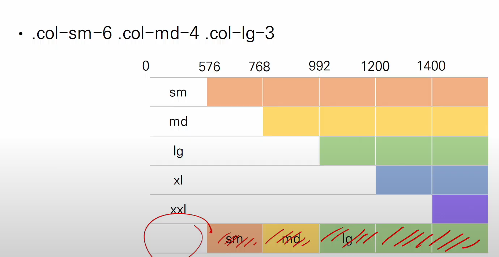
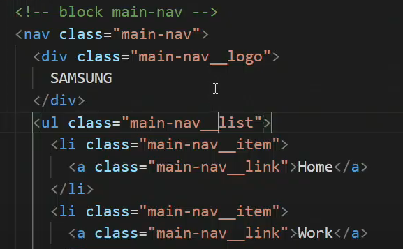
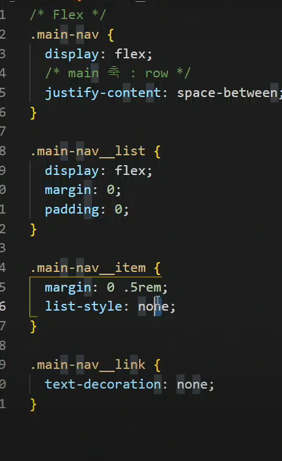

# 220211

### 👨🏼‍🏫과정 후기와 느낀점

- css 파일 연결하는 코드 ! (시험내시려나봄)

  ```html
  <link rel="stylesheet" href="연결css 이름.css">
  ```

  ---

  #### 브라우저의 너비에 따라서 변동하는 화면과 화면 내 요소들 만들기

  `@media` 를활용하면 된다.

  ```css
  @media 특정 옵션 {
  	선택자 {
  	적용하고자 하는 옵션;
  	}
  }
  ```

  ```
  @media (orientation : landscape) : 가로모드일 때의 설정 (너비 > 높이)
  @media (orientation : portrait) : 세로모드일 때의 설정 (높이 > 너비)
  ```

  ##### Media type : all, print, screen, speech

  웹사이트에서 출력하고 싶을 때 적용하고자 하는 옵션

  ```css
  @media only print {
  	*{
  	color : 무슨색; !important
  	}
  }
  ```

  특정 너비에서만 특정한 색상으로 만드는 코드

  ```css
  @media (width: 300px /*특정 너비*/) {
  	선택자 {
  	 color : 주고싶은 색상;
  	}
  }
  ```

  두 조건이 모두 만족할 때 적용되는 코드

  ```
  @media (max-height: px) and (max-width: px)
  @media (max-height: px), (max-width: px)
  ```

  ---

  ##### Bootstrap breakpoints 활용 잘하기 (시험에 꼭 나옴)

  ```
  sm, md, lg, xl, xxl (xs 는 사라졌다.. 그냥 col 로만 쓰면 된다.)
  ```

  

  작은 조건에서 출발해서 큰 조건을 만날 때가지 적용된다 생각

  ---

  ##### BEM (Block Element Modifier)방법론

  - Block

    - 재사용 가능하고 기능적으로 독립적인 개체
    - .block
    - .block__elem
    - .block-modifier block__elem--modifier
    - 

    - 이처럼 네이밍을 한다. 

  

  - CSS 적용할 때...

  ---

  #### Favicon

  내가 좋아하는 아이콘을 만든다.

  생성기를 활용하면 된다. https://favicon.io/

  만든 후 이미지 파일을 <link 태그에 설정해준다. href 에 경로 수정해서 지정하는 것 필수>

  보통 아이콘을 쓸 때 `<i>` 태그를 많이 사용한다

  비슷한 것으로 `font awesome`이 있다.

  ---

  #### SCSS (Sass)

  - CSS 를 만들기 위한 도구로 변수, 상속, mixin 

  ##### 코드경량화 (minify)

  - 웹 사이트 접속 시 모든 소스코드는 네트워크를 통해 전송되므로 더욱 빠른 다운로드를 위해 파일의 공백 및 개행 문자를 제거하여 경량화 함

  - 부트스트랩을 활용한 영화 페이지 제작!!
  - media 에 대해서도 이해
  - 뇌가 관통당하는 느낌을 되살려줌!!!!🤯

  ------

  #### 어려웠던 부분 🤷🏼‍♂️

  - 부트스트랩에서 어떠한 컴포넌츠를 가져와야 할 지 많은 고민...!
    - 이게 잘 어울리려나...
  - 미리 적용되어 있는 부분들을 찾아서 수정해내는 것
  - 이미지나 특정 버튼을 눌렀을 때 홈페이지를 이동시키는 것
  - 링크를 걸어도 마우스 버튼이 변경되지 않았던 것
  - 카드 사이의 거리 외관을 어떻게 줄여야할 지 모름..
  - breakpoints 사용할 때 헷갈려하는 것
    - col-12 col-lg-2 라면 : 992픽셀 아래로 내려가게 된다면 12칸의 그리드를 다 사용하고, 이상인 경우 2칸만 쓰고 있다.
  - 커뮤니티에서 aside랑 테이블을 같은 위치에 두는 법을 모르겠음
    - div 하나로 묶어서 justify-content-between 하기
  - 명세서를 읽고도 이해할 수 없었던 부분이 article 로 만들라는 것? 집합처리?
    - 그리고 또 기존 table을 없애는 걸 모르겠다.

  ------

  #### 새로 배운 것들 🙆🏼‍♂️

  - 이미지, 특정 버튼 홈페이지 이동, 마우스 버튼

    - ```html
      onclick="location.href='이동할 페이지 공간'"
      ```

    - ```html
      style="cursor:pointer;" <!--커서를 위로 갖다대면 손가락 모양으로 변함-->
      ```

  - 이미지 썸네일화 시키기를 이용하면 카드 내 더 깔끔해짐

    - ```html
      class="img-thumbnail" 
      ```

  ------

  #### 느낀점 💁🏼‍♂️

  - 내 손으로 직접 페이지를 만들 수 있어서 흥미로웠다.
  - 원하는 대로 잘 안만들어져서 슬펐다.
  - 그래도 프론트 엔드에 대한 흥미가 어느정도 있다는 점을 확인한 것 같다.
  - 이미 적혀진 코드들에도 조금만 고치면 알아서 수정할 수 있는 방법이 있느니 잘 찾아보고 읽어보자!!
