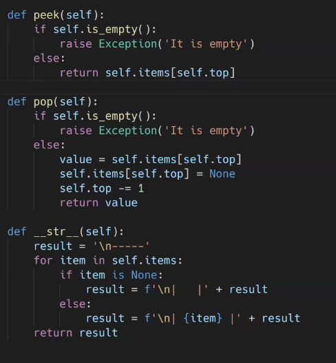

# 220221

### 👨🏼‍🏫과정 후기와 느낀점

- 과목평가

  - 2차원 배열 구간합
  - 델타와 합 비교
  - 이진탐색

- 자료 구조 (스택)

  - 데이터를 `효율`적으로 `저장`하고 `구성`하고 관리하기 위한 방법

  - 데이터?

    - 경험이나 관찰로부터 얻어진 `조직화된 정보`의 모음
    - ex > 시간표 : 각 과목에 대한 데이터를 확인할 수 있음
    - 초창기 컴퓨터 공학쪽에서는 데이터를 프로그램이 아닌 모든 것을 이야기한다.
    - Von Neumann (1903) : 프로그램도 일종의 데이터다! 라고 함
    - 프로그램 내장식 컴퓨터의 등장. 필요한 모든 것을 컴퓨터에 저장해서 사용함

  - 컴퓨터의 저장 매체 : 스토리지 / 메모리

    - 스토리지 : HDD, SSD 등 용량이 매우 큰 데이터를 저장하고 불러오는데 시간이 오래 걸림, 지금은 아니어도 나중에 사용할 데이터들을 저장한다.
    - 메모리 : 데이터가 임시적으로 저장되는 곳, 용량이 작지만 속도가 빠르다. 지금 필요한 데이터를 사용
      - 칸이 나뉘어진 긴 막대기라고 생각
      - 나뉘어진 칸 중 랜덤으로 데이터가 저장된다. (Random Access Memory)
      - 각 칸마다 주소값이 지정되어 있다.

  - 데이터 타입

    - 현실 세계의 데이터를 0과 1로 표현해서 메모리에 저장하기 위한 방법
    - 좋긴 하지만 한계가 존재한다.
    - 더 다양한 데이터 타입을 표현하고 싶어지고 이로인해 User-defined data type : Class가 등장하게 됨

  - 자료 구조

    - 선형 자료구조 VS 비선형 자료구조 2가지로 나뉘게 됨
    - 자료구조, 왜 필요한가?
      - 데이터의 구조를 전체적으로 파악해서 효율적으로 사용이 가능해진다.
      - 트리구조 

    - 데이터에 맞는 자료구조를 사용하면 `표현, 이해, 활용`이 쉬워진다.

  - 추상 데이터 타입

    - 추상화 - 특정한 대상이나 사람이나 상황이 아닌 일반적인 개념으로 표현, 데이터가 가지고 있는 공통점 (구조, 연산)
    - ADT (Abstract Data Type)
      - `구조화된 데이터`를 필요한 `연산`과 함꼐 묶어서 표현하는 방법
      - 스마트폰에서 자주 사용되는 데이터 구조
      - 개별적인 특징을 지우고, 데이터 구조의 특징을 도출(순서가 있는 나열된 구조)한다. 그리고 필요한 연산(추가, 삭제, 수정 등)을 정의한다.

  - 스택 (Stack)

    - 물건을 쌓아 올린듯 자료를 쌓아 올린 형태의 자료 구조
    - 특징
      - 가장 마지막에 들어간 것이 가장 처음에 나온다. (후입선출 LIFO : Last-In-First-Out)
      - `가장 위 (top)`에서만 데이터의 삽입(Push) & 삭제(Pop)가 일어난다. (중간, 마지막 등 특정 순서에서는 일어나지 않음)

    - 함수 콜 스택
      - 재귀(팩토리얼) 함수 공부했을 때 팩토리얼도 결국 스택이라고 볼 수 있다. 

    - 스택 오버플로우
      - 가장 최신의 정보들이 넘쳐 흐른다고 하여 만들어진 페이지

  - ADT 스택의 연산 (6가지)

    - CreateStack : 스택을 생성하는 연산 `size`필요
    - IsEmpty : 스택이 현재 비어있는지를 확인하는 연산, `True, False` 로 리턴
    - IsFull : 스택이 현재 꽉 차있는지 확인하는 연산, `True, False` 로 리턴
    - Push : 스택에 새로운 데이터 요소를 삽입하는 연산
    - Pop : 스택에서 가장 위에 있는 요소를 제거하는 연산, 그 데이터를 뽑으면서 보여줌 (데이터 반환)
    - Peek : 스택에서 가장 위에 있는 요소를 반환하는 연산 (Pop과 다르게 뺴지 않고 위에 뭐가 있는지만 알려줌)

  - 스택의 데이터 구조 (3가지)

    - top : 스택의 가장 위에 위치하고 있는 데이터

    - size : 스택의 크기를 저장하고 있는 데이터

    - items : 스택에 담길 데이터를 저장할 데이터 구조

    - ```python
      class Stack:
          def __init__(self, size):
              self.size = size
              self.items = [None] * self.size
              self.top = -1  # -1 : 활성화 되어있지 않은 상태임을 일컫음
              
          def is_empty(self):
              return True if (self.top == -1) else False
          
          def is_full(self):
              return True if (self.top + 1 == self.size) else False
          
          def push(self, item):
              if self.is_empty():
                  raise Exception('it is full')
              else :
                  self.top += 1
                  self.items[self.top] = item
      ```

    - 

  - 결국 스택은 파이썬에서는 리스트 형식으로 제공되어지고 있다.


---

### 💁🏼‍♂️가장 기억에 남는 교육 내용

- 교수님은 잘생겼다.

---

### 💫부족한 부분과 개선방향

- 
