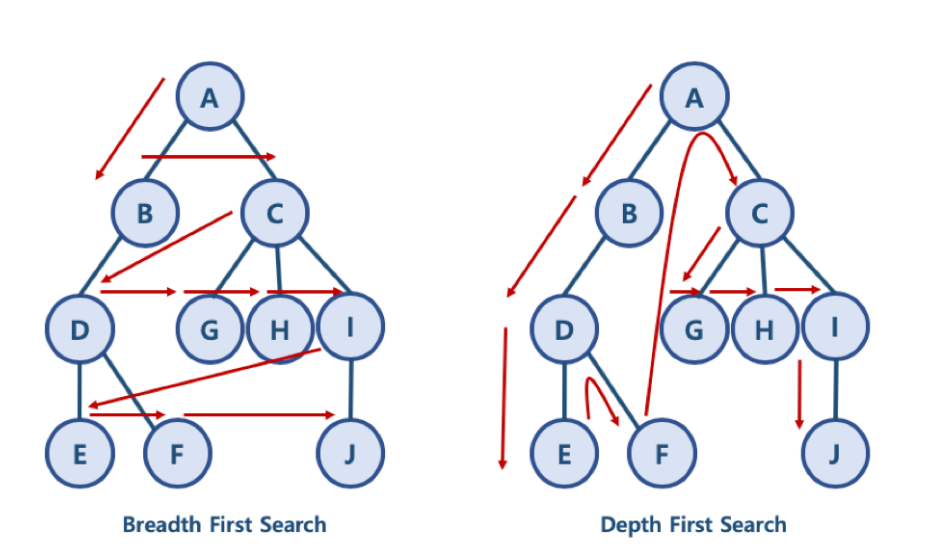

# 220222

### 👨🏼‍🏫과정 후기와 느낀점

- 스택

  - 반복문자 지우기

    - 최종 출력에서 변수 입력 실수... 마지막까지 잘 살펴보자

  - 괄호 검사

    - SWEA 런타임 오류 : 해결 방안..?
    - 해결 완료 > 조건의 문제. 찾아야 하는 값이 없는 경우에 끝내버려야 한다는 것을 잊지 말자
    - 생각해야 할 조건들을 다 적용하기

  - 비밀번호

    - 스택 활용하여 스택이 비어있거나, 스택에 없는 수가 주어지면 그 숫자를 스택에 집어넣고
    - 스택에 있는 수가 나타난다면, pop으로 스택에서 중복되는 수를 지운다.
    - 이후 모두 다 돌고 스택의 값을 프린트하면 최종정답이 나온다.

  - 종이 자르기

    - 10, 20 이 단위를 생각하지말고, 결국에는 1의 자리수로 생각해서 계산해도 된다.
    - DP (이미 결과값을 이용할 수 있는 것을 사용해서 같은 계산 반복을 줄이도록 하는 것)
    - 스택에다가 미리 결과값을 구할 수 있는 N의 길이가 10일때, 20일때를 저장해서 30, 40,50일때의 규칙을 찾아서
    - 기존 스택을 활용하여 답을 뽑아낼 수 있도록 생각한다.
    - [0] 을 넣어서 스택의 인덱스 번호를 주어진 N의 수에서 바로 찾아갈 수 있도록/ N = 30이면 n=3, 3의 값 도출

    

- 취업 특강


- 개인적으로 예습

- DFS(Depth First Search)

  - 그래프 자료에서 데이터를 탐색하는 알고리즘으로 위에서 아래로 찾는 방식을 말함

  - 

  - ```python
    graph = dict()
     
    graph['A'] = ['B', 'C']
    graph['B'] = ['A', 'D']
    graph['C'] = ['A', 'G', 'H', 'I']
    graph['D'] = ['B', 'E', 'F']
    graph['E'] = ['D']
    graph['F'] = ['D']
    graph['G'] = ['C']
    graph['H'] = ['C']
    graph['I'] = ['C', 'J']
    graph['J'] = ['I']
    ```

  - 데이터를 찾을 때는 항상 `앞으로 찾아 가야할 노트`와 `이미 방문한 노트`를 기준으로 데이터를 탐색한다. (원칙 기억!!!)

    - 특정 노드가 앞으로 찾아가야할 노드라면 계속 검색, 이미 방문한 노드면 무시하거나 따로 저장함

  - 구현 방식

    - 스택 / 큐 OR 재귀 함수

  - 리스트 활용

    - 스택을 활용한 방식으로 추가된 노드들 중에서 가장 끝에 있는 것을 뽑아서 검색하는 방식

    - ```python
      def dfs(graph, start_node):
       
          ## 기본은 항상 두개의 리스트를 별도로 관리해주는 것
          need_visited, visited = list(), list()
       
          ## 시작 노드를 시정하기 
          need_visited.append(start_node)
          
          ## 만약 아직도 방문이 필요한 노드가 있다면,
          while need_visited:
       
              ## 그 중에서 가장 마지막 데이터를 추출 (스택 구조의 활용)
              node = need_visited.pop()
              
              ## 만약 그 노드가 방문한 목록에 없다면
              if node not in visited:
       
                  ## 방문한 목록에 추가하기 
                  visited.append(node)
       
                  ## 그 노드에 연결된 노드를 
                  need_visited.extend(graph[node])
                  
          return visited
      ```

    - deque를 활용한 구현

    - ```python
      def dfs2(graph, start_node):
          ## deque 패키지 불러오기
          from collections import deque
          visited = []
          need_visited = deque()
          
          ##시작 노드 설정해주기
          need_visited.append(start_node)
          
          ## 방문이 필요한 리스트가 아직 존재한다면
          while need_visited:
              ## 시작 노드를 지정하고
              node = need_visited.popleft()
       
              ##만약 방문한 리스트에 없다면
              if node not in visited:
       
                  ## 방문 리스트에 노드를 추가
                  visited.append(node)
                  ## 인접 노드들을 방문 예정 리스트에 추가
                  need_visited.extend(graph[node])
                      
          return visited
      ```

    - 재귀함수로 DFS 구현 :  visited 자료형을 기본 함수 인자로 포함시키고, 방문한 리스트들을 재귀함수를 통해서 계속 visited에 담는 방식입니다. 

    - ```python
      def dfs_recursive(graph, start, visited = []):
      ## 데이터를 추가하는 명령어 / 재귀가 이루어짐 
          visited.append(start)
       
          for node in graph[start]:
              if node not in visited:
                  dfs_recursive(graph, node, visited)
          return visited
      ```

---

### 💁🏼‍♂️가장 기억에 남는 교육 내용

- 

---

### 💫부족한 부분과 개선방향

- 제발 ... 마지막 출력 부분 습관을 조심하자
  - t 인데 tc로 써서 출력값 오류나지 않도록
- 스택 개념, DP 활용해야 할 경우 알아내기
  - 문제를 보고 과정이 생각 안나면 출력값(결과값)을 가지고 규칙성을 찾아보기
  - 스택, 메모이제이션 응용 문제 많이 풀어보기 (다시 풀거나 보고 익히기)
