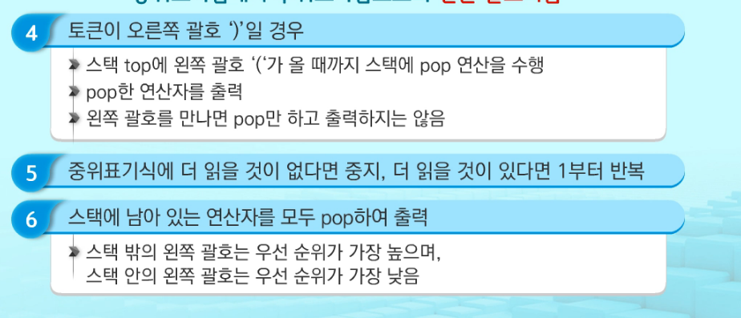
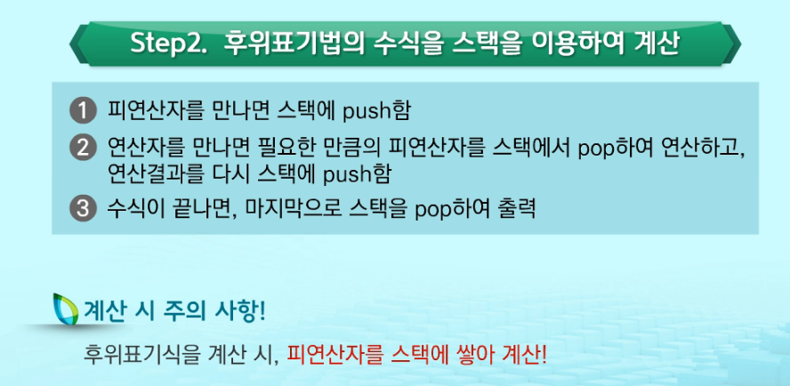

# 220223

### 👨🏼‍🏫과정 후기와 느낀점

- DFS
  - 시작 정점의 한 방향으로 갈 수 있는 경로가 있는 곳까지 깊이 탐색해 가다가 더 이상 갈 곳이 없게 되면 가장 마지막에 만났던 갈림길 간선이 있는 정점으로 되돌아와서 다른 방향의 정점으로 탐색을 계속 반복해서 결국 모든 정점을 방문 순회하는 것
  - 후입 선출의 스택 구조를 활용한다.
  - 가는 순서는 내가 정한 규칙으로 가면 된다. (오름차순이든 원하는 순서든)
  - visited를 하고 pop과정을 거쳐야 DFS의 규칙을 활용하는 것이다. 전부 True여도 pop을 이용할 것
  - 대체로 행을 출발 열을 도착으로 정해서 표시한다 (표로 만들어서)
  - 표로 그려서 봤을 때 단방향 그래프 / 무방향 그래프에 차이가 있다
    - 단방향 그래프일 때는 대각선을 기준으로 한 쪽에 숫자가 적혀있을 것
    - 무방향 그래프일 때는 대각선을 기준으로 위, 아래의 공간이 같은 값이 대칭으로 놓여있을 것
    - 직접 손으로 그려보며 노드와 간선을 확인해본다.

  - 방문하면 push(append)하고, 인접한 노드에 방문하지 않은 정점이 없으면 (더이상 갈 곳이 없다면) pop을 한다.
    - 초기 상태 : 배열 visited 를 False로 초기화시켜놓고, 공백의 스택을 생성한다.
    - 수업 노션 확인해보기...


- 스택 2

  - 계산기

    - 문자열로 된 계산식이 주어질 때 스택을 이용하여 이 계산식의 값을 계산할 수 있다.

    - 문자열 수식 계산의 일반적 방법

      - 중위 표기법의 수식을 후위 표기법으로 변경한다 (스택 이용)

      - 후위 표기법의 수식을 스택을 이용하여 계산한다

      - ```
        중위표기법 (infix notation)
        연산자를 피연산자의 가운데 표기하는 방법  ex) A+B
        
        후위표기법 (postfix notation)
        연산자를 피연산자 뒤에 표기하는 방법 ex) AB+
        ```

    - 중위표기식의 후위표기식 변환 방법

      - 수식의 각 연산자에 대해서 우선 순위에 따라 괄호를 사용하여 다시 표현
      - 각 연산자를 그에 대응하는 오른쪽 괄호의 뒤로 이동시킴
      - 괄호를 제거
      - 

    - 스택을 이용한 방식

      - 입력 받은 중위 표기식에서 토큰을 읽는다.  #` 토큰 : 수식에서 의미있는 최소의 단위`
      - 토큰이 피연산자이면 토큰을 출력한다.
      - 토큰이 연산자(괄호포함)일 때, 이 토큰이 스택의 top에 저장되어 있는 연산자보다 우선순위가 높으면 스택에 push
      - 그렇지 않으면 스택 top의 연산자의 우선순위가 토큰의 우선순위보다 작을 때까지 스택에서 pop한 후 토큰의 연산자 push
      - 만약 top에 연산자가 없으면 push
      - 

    - 

  - 중위 표현식을 후위 표현식으로 바꾼 후, 바꾼 후위 표현식을 또 다시 꺼내 연산을 해내는 문제가 나온다.

    - isdecimal() : 주어진 문자열이 숫자인지 판별하는 메서드
    - if 꺼낸 변수 not in '+-*/'<< 이렇게 써도 된다.
    - 후위 표현식으로 바꾸는 코드는 거의 변동이 없다. 우선순위도 똑같고 변동이 없기 때문에


- 백트래킹
  - 해를 찾는 도중에 막히면 (해가 아니면) 되돌아가서 다시 해를 찾아가는 기법
  - 최적화 문제와 결정 문제를 해결하는데 좋다
    - 결정문제 : 문제의 조건을 만족하는 해가 존재하는지의 여부를 YES 또는 NO가 답하는 문제
      - 미로찾기 / n-Queen / Map coloring / 부분집합의 합
  - 백트래킹과 깊이 우선탐색과의 차이
    - 해결책으로 이어질 것 같지 않으면 더이상 경로를 따라가지 않음으로써 시도 횟수를 줄임 (가지치기 Prunning)
    - 깊이우선탐색이 모든 경로를 추적하는데 비해, 백트래킹은 불필요한 경로를 조기에 차단한다
    - 깊이우선탐색을 가하기에는 경우의 수가 너무나 많음. 즉, N! 가지의 경우의 수를 가진 문제에 대해 깊이우선탐색을 가하면 처리가 불가능한 문제이다.
    - 백트래킹 알고리즘 적용 시 일반적으로 경우의 수가 줄어들지만, 이 역시 최악의 경우 여전히 지수 함수 시간을 요하므로 처리가 불가능
  - 백트래킹 기법
    - 유망성 점검 후 유망하지 않다고 결정되면 그 노드의 부모로 되돌아가 다음 자식 노드로 간다.
    - 노드 방문 시 노드를 포함한 경로가 해답이 될 수 없으면 유망하지 않다고 하며, 가능성 있으면 유망하다고 한다.
    - 가지치기 : 유망하지 않는 노드가 포함되는 경로는 더이상 고려하지 않는다.
  - 절차
    - 상태 공간 트리의 깊이 우선 검색을 실시
    - 각 노드가 유망한지 점검
    - 만일 그 노드가 유망하지 않으면, 그 노드의 부모 노드로 돌아가서 검색을 계속

---

### 💁🏼‍♂️가장 기억에 남는 교육 내용

- 프로그램은 후위표현식으로 연산 순서를 정한다.
  - 중위표현식과 후위표현식의 개념부터.. 그리고 코드 
  - 다행히 후위 표현식의 코드는 변동되는 경우가 없다고 한다.
  - 후위 표현식을 계산하는 코드도 정해져있어서 변동이 없다. 그대로 복붙~

- 백트래킹
  - 정해진 코드가 없음. 그냥 하다가 조건에 부합하지 않는다면 이후의 것은 하지 않고 다시 돌아가서 조건에 충족하는 코드를 실행하도록 하는 것이다.
  - 유망한 포인트를 찾아나가면서 경우의 수를 줄여 나가는 것이 백트래킹의 포인트이다.

- 순열
  - 순서가 있고/ 없고 + 복원/ 비복원 추출
  - 노션에 있는 코드를 외우고 주어진 input 값 (n,r)만 바꾸어 사용하면 된다.

- 

---

### 💫부족한 부분과 개선방향

- 기본 개념이 잡혀 있지 않음
  - 복습... 그 해당 문제 많이 접해보기
- 알고리즘 문제풀이. 생각
  - 어렵다
