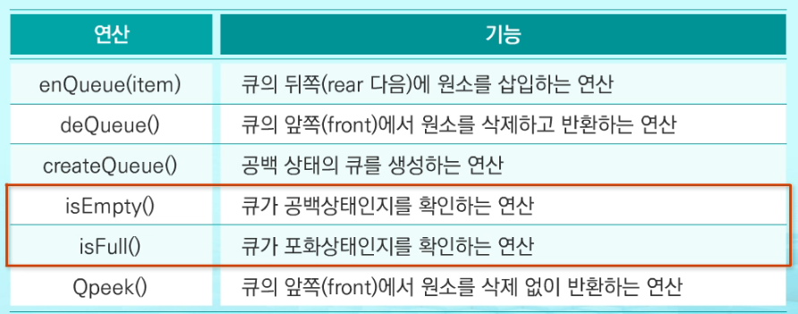
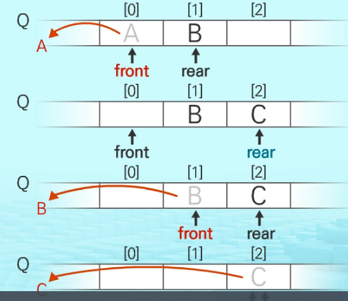

# 220225

### 👨🏼‍🏫과정 후기와 느낀점

- Queue

  - 스택과 마찬가지로 삽입과 삭제의 위치가 제한적인 자료 구조

  - 뒤에서 삽입 - 앞에서 삭제

  - 큐에 삽입 순서대로 원소 저장, 가장 먼저 들어온 것이 삭제

  - 선입선출구조 (FIFO) first in first out

    - 머리 Front : 저장된 원소 중 첫번째 원소, 데이터의 삭제가 일어난 위치
    - 꼬리 Rear : 저장된 원소 중 마지막번째 원소, 데이터의 추가가 일어난 위치
    - `append(원소), pop(0) `<< 이 두 개가 큐의 포인트이다. 선입선출!!

  - 기본연산

    - 삽입 : enQueue
    - 삭제 : deQueue
    - 

  - 기본 연산 과정

    - 공백 큐 생성 createQueue();
    - 원소 A 삽입 enQueue(A);
    - 원소 B 삽입 enQueue(B);
    - 원소 반환/삭제 : deQueue(); 
    - 최종적으로 front와 rear가 같은 곳에 있다면 큐가 비어있다는 것
    - 

  - Queue의 종류

    - 선형 큐

      - 가장 간단하고 기본적인 형태, 리스트 사용

      - 1차원 리스트를 이용한 큐

        - 큐의 크기  == 리스트의 크기
        - front : 저장된 첫번째 원소의 인덱스
        - rear : 마지막 원소의 인덱스
        - front 와 rear 가 같은 위치에 있으면 공백 상태가 된다.

        

      - 상태 표현

        - 초기 상태: front = rear = -1
        - 공백 상태: front = rear
        - 포화 상태:  rear = n-1 (n : 리스트의 크기, n-1 : 리스트의 마지막 인덱스)

        

    - 원형 큐

      - 선형에서 발전된 형태, 리스트 사용

      - ```
        rear = (rear+1) % n  << 이런 형식으로 추가, 제거할때 표현하는데 이는 계속 순환되도록 하여 원형으로 만들기 위해 나머지를 이용하는 것이다. 
        ```

      

    - 연결 큐

      - 연결 리스트 형식을 이용
      - 파이썬에서는 그냥 리스트가 연결 큐가 가지고 있는 특징을 가지고 있다.

      

    - 우선순위 큐

      - 모든 응용
      - 우선순위큐는 Heap 이라는 자료구조를 가지고 구현합니다.
      - Heap : 완전 이진 트리(Complete Binary Tree)구조를 가진 자료구조입니다.
      - 완전이진트리 ? -> 이진트리는 포화 이진 트리에서 마지막 레벨의 노드가 제거된... -> 포화이진트리?? -> 이진트리인데.. -> 이진트리?? -> 트리인데.. -> 트리??

  - DEQ (Doubly-Ended Queue) 덱

    -  큐는 큐인데 addQ랑 deleteQ를 양 끝에서 모두 일어날 수 있는 특수적인 것이다. 이를 지원하는 신기한 메서드들이 존재한다.
    - AddQ_FRONT & DeleteQ_FRONT
    - AddQ_REAR & DeleteQ_REAR
    - 
    - 
    - 

    

    

    - q.pop(0) 을 사용하면 맨 앞의 덱에서 빠질 것 같지만, 그렇지 않다. 오류가 난다. popleft()를 사용하도록...

  - 


---

### 💁🏼‍♂️가장 기억에 남는 교육 내용

- appendleft()는 있지만 appendright()는 없다
  - 이거에 낚이지 말도록.. 마치 나처럼
  - 교수님을 웃기게 해드렸다. 성공적

- 

---

### 💫부족한 부분과 개선방향

- 전체적으로 부족하다. 스택이랑 큐까지는 원리는 이해함
  - 근데 더 깊숙히 들어갈 때 너무나 벅차다. DFS, BFS...
  - 
