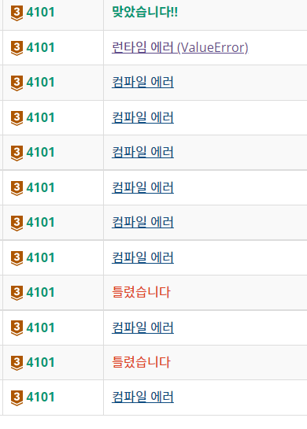

# 220301

### 👨🏼‍🏫과정 후기와 느낀점

- 백준 문제풀이

  - 오늘 날짜

    - 날짜를 출력할 수 있는 메서드

    - ```python
      import datetime
      
      now = datetime.datetime.now()
      print (now.year,'-', now.month,'-', now.day,'')
      ```

  - 저작권

    - 올림을 할 경우에는 반대로 결과값에 -1을 하여 기존 값이랑 곱을 한 후 +1 을 해준다.

  - 인공지능 시계

    - //, %를 적절히 사용해야하는데 이를 다시 확인해볼 것
    
  - 크냐?
  
    - 내가 while문을 어떻게 써야할 지 다시 한번 생각해보게 된 문제
    - 입력값을 확인하고 어떻게 들어오는지 그리고 출력은 어떻게 되는지 자세히 살펴보기
  
  


---

### 💁🏼‍♂️가장 기억에 남는 교육 내용

- 크냐..?ㅠㅠ
- 

---

### 💫부족한 부분과 개선방향

- 반례 찾는 것
  - 다양한 반례는 없을 지 왜 틀렸는지 생각해보고 반례 찾아보기
- 컴퓨터를 이기려고 하는 것
  - 왜 틀렸는지 천천히 다시 생각해보고 제출해보기
  - 무작정 제출 누르지 말기
