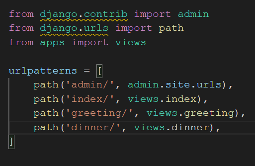
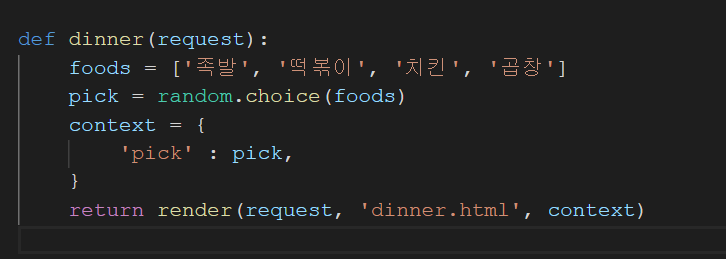
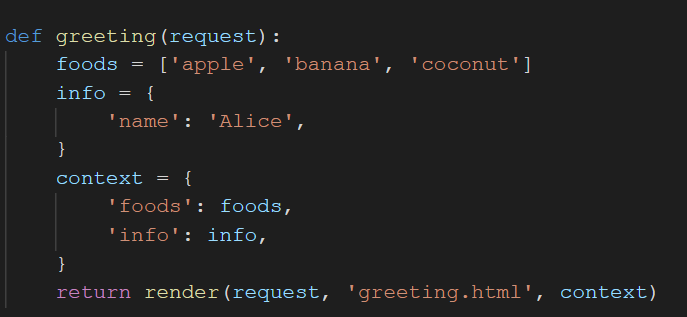
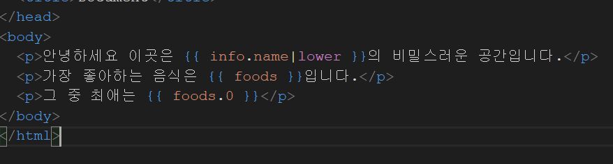

# 220302

### 👨🏼‍🏫과정 후기와 느낀점

- django

  - 정해져있는 프레임워크이기 때문에 주어진 규칙을 잘 따라야 작동한다.

  - 작업 순서 !!!

    - `python -m venv venv` (가상환경 만들기)

    - `pip install django==3.2.12`  (3.2.12 버전의 장고 설치하기)

    - `pip freeze > requirements.txt`  (가상환경 및 장고 버전에 대한 요구사항 표시)

    - `django-admin startproject mypjt . `(프로젝트 생성하기 . 꼭 필수로 작성하기)

    - `python manage.py runserver` (서버 확인해보기)

    - `python manage.py startapp articles` 앱 생성하기 

    - settings.py 에 앱 등록하기

      - ```html
        INSTALLED_APPS = [
            'articles',  << 추가하기
            'django.contrib.admin',
            'django.contrib.auth',
            'django.contrib.contenttypes',
            'django.contrib.sessions',
            'django.contrib.messages',
            'django.contrib.staticfiles',
        ]
        ```

    - urls.py 에서 모듈 불러오기

      - 
      
    - views 작성
    
      - 

      - def 함수명(request): 

        foods 리스트에서 random 기능의 choice 함수를 이용해 랜덤으로 하나 뽑아서 출력한다.
    
    - templates 작성
    
      - views 에 보여질 템플릿을 작성하기 위해서는 articles 폴더 안에 templates 폴더를 생성 후 그 안에 html 파일을 생성하여 내용을 작성한다.
    
  - 다양한 함수도 사용이 가능하다
  
  - views에서 random 기능을 사용할 때 맨 위에 `import random` 을 사용할 것
  
  - 
  
    - 사진과 같이 리스트로 사용이 가능하며, 딕셔너리(info 부분)로도 사용이 가능하다.
    - context 안에 key : value 의 값을 지정해두고 마지막 return 의 마지막에 context를 적용시켜 key 값을 호출하여 결과를 불러오도록 한다.
    - 
    - 위의 사진처럼 info.name < 이렇게 사용한다면 context 변수 안의 info key 안에 name key에 위치한 Alice를 호출한다. 그 뒤에 | < 이것과 함께 함수를 적용하면 모두 소문자로 alice가 출력된다.
    - foods key를 가져오면 리스트 그대로 출력되며, foods.0 (인덱스번호)를 입력하면 리스트에서 뽑아와서 결과물을 보여준다.
  
  - Django Template Language(DTL)
  
    - 조건, 반복, 변수 치환, 필터 등의 기능을 제공하는 빌트인 함수
    - 프로그래밍적 로직이 아니라 프레젠테이션을 표현하기 위한 것
    - Python처럼 일부 프로그래밍 구조(if나 for 등)을 사용할 수 있지만 이것은 해당 Python 코드로 실행되는 것이 아니다. => 파이썬의 특징은 있지만 파이썬이 아니다. 장고다.
    - Variable  `{{variable}}`
      - render를 사용하여 views.py 에서 정의한 변수를 template 파일로 넘겨 사용하는 것
      - 공백이나 구두점 문자 또한 사용할 수 없다.
      - dot(.)을 사용하여 변수 속성에 접근할 수 있다.
      - render() 의 세번째 인자로 {'key': value}와 같이 딕셔너리 형태로 넘겨주고, 정의한 key에 해당하는 문자열이 template에서 사용 가능한 변수명이 된다.
    - Filters `{{ variable|filter }}` 
      - 60개의 빌트인 필터를 제공 받아 표시할 변수를 수정할 때 사용한다.
      - `{{ variable | truncatewords:30 }}` chained가 가능하며 일부 필터는 인자를 받기도 한다.
    - Tags ``
      - 출력 텍스트를 만들거나 반복 또는 논리를 수행하여 제어 흐름을 만드는 등의 변수보다 복잡한 일들을 수행한다. 약 24개의 빌트인 태그들이 있다.
      - 일부는 열고 닫는 태그처럼 시작과 종료 태그가 필요하다
      - ``
    - Comments `{# #}`
      - 주석을 사용하기 위해 씀
      - 기존 html 주석도 사용함
      - Ctrl + / 을 활용해서 주석처리도 가능하다.
      -  ` 주석 `
  
  - 템플릿의 상속
  
    - 상속을 통해 사용하면 사이트의 모든 공통 요소를 포함하고, 하위 템플릿이 재정의(override) 할 수 있는 블록을 정의하는 기본 뼈대역할(skeleton) 템플릿을 만들 수 있다.
  
      - base를 가져와서 자식들을 재정의할 수 있음
      - base.html : CDN을 적용하여 자식을 다 CDN이 적용된 상태로 만들 수 있음
  
    - ```django
       : 자식 템플릿이 부모 템플릿을 확장한다는 것을 알림
      반드시!!! 템플릿의 최상단에 작성 되어야 한다.
       
      => 하위 템플릿에서 재지정(overriden)할 수 있는 블록을 정의
      하위 템플릿이 채울 수 있는 공간을 말한다.
      ```
  
    - ```django
       : 템플릿을 로드하고 현재 페이지로 렌더링
      템플릿 내에 다른 템플릿을 포함하는 방법
      ```
  
  - Django 설계 철학
  
    - 표현과 로직 분리
    - 중복을 배제


- 알고리즘 공부(파이썬 공부)
  - IM 시험 떨어진 것 다시 풀어봄
    - 16분만에 모든 테스트 케이스 통과했음. 긴장으로 인해서 문제를 풀지 못한 것에 대한 아쉬움 
    - 그래도 이미 끝났으니 다음에는 스스로를 컨트롤 잘해서 문제를 잘 해결할 수 있도록 하자
  - 과자
  - 네 번째 점
  - 


---

### 💁🏼‍♂️가장 기억에 남는 교육 내용

- 장고는 파이썬으로 만들어진 프레임워크이므로, 우리는 계속 파이썬을 쓰고 있다고 생각하고 코드를 작성해야 한다.
- 잊지말자 !!! `url > views > templates` 순으로 작성하는 것을!!

---

### 💫부족한 부분과 개선방향

- html, css 부분 까먹음
  - 다시 복기할 수 있도록 꾸준히 검색하도록 한다.
- 수업 때 이해 못하는 부분이 많음 특히 장고에서 활용되는 부분
  - 계속 습관적으로 만들고 삭제하고 순서를 익혀야 할 듯!!!
