# 220303

### 👨🏼‍🏫과정 후기와 느낀점

- django 심화2

  - 다양한 빌트인 DTL들

    - for 문 사용

    - 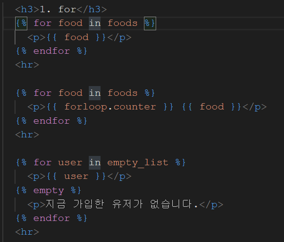

    - ```django
       
      
      {{ forloop.counter }} 1부터 번호를 매김. counter0을 하면 0부터 매기며 1,2,3 등 숫자를 사용하면 번호가 매겨지지 않는다.
      
       비어있는 경우에 하단에 작성된 html 양식을 보여준다.
      ```

    - 

  - if 문

    - ]

    - ```django
       조건에 부합시 출력할 내용 
       도 사용 가능하다.
      
       첫번째로 나온 값이 True라면 실행
      ```

    - 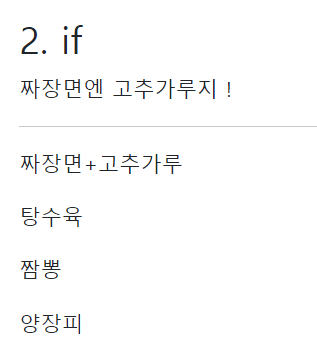

  - 길이 필터 활용

    - 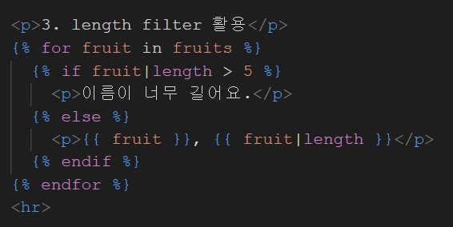
    - 두 번째 `if fruit | length > 5` 를 통해 5보다 큰 글자수는 `이름이 너무 길어요.` 를 출력하도록 한다는 것을 유추할 수 있고 `else 문`을 통해 그 아래의 글자는 `과일명, 과일명의 길이`를 출력하게 한다.
    - 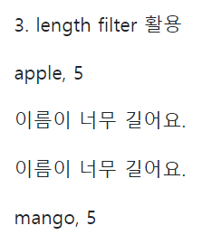

  - 로렘입숨 활용한 글자 문단 자르기

    - 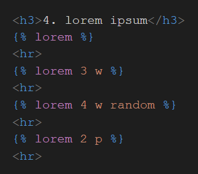
    - 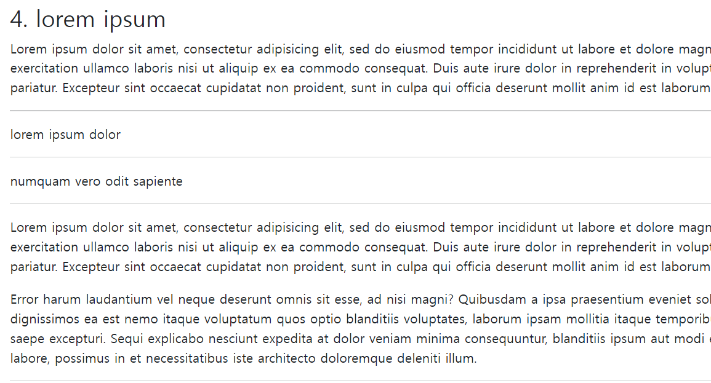

  - 글자 관련 필터 & 연산

    - 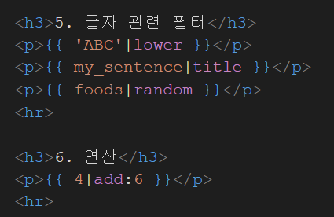
    - |title << 공백 기준 단어들의 첫 글자를 대문자로 만들어주는 DTL 인데 아래 사진에 빠짐
    - 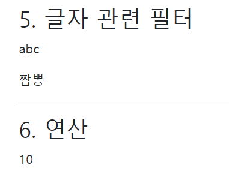
  
  - 다양한 날짜의 표현
  
    - 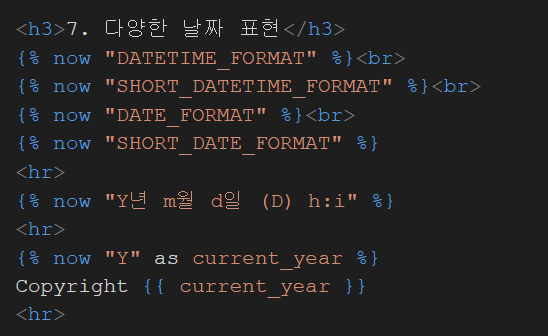
    - 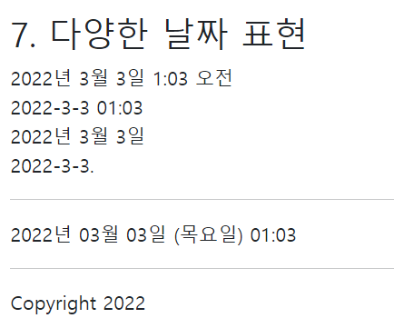
    
  - 데이터 전송하고 읽어내기
  
    - 데이터를 보낼 때
    - 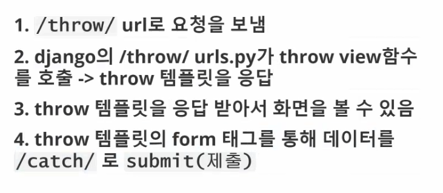
    - 데이터를 받을 때
    - 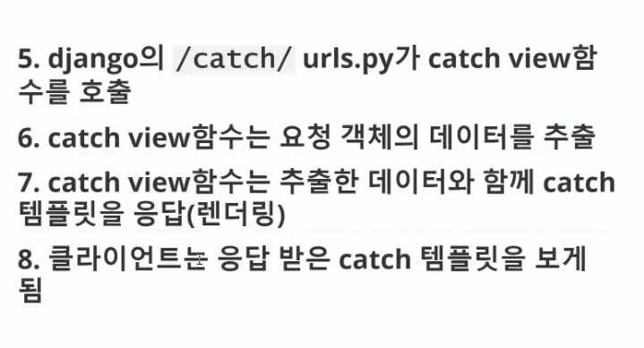
  
  - 여러 서버 연결하기
  
    - 만약에 프로젝트의 urls.py에서 여러 앱들을 연결하게 된다면 어떨까?
    - 유지 보수가 어려워진다. 코드를 한눈에 보기 어려워지고 구조가 복잡해진다.
    - 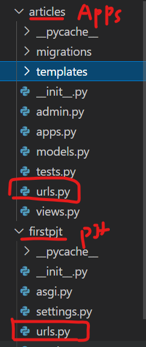
      - 원래는 프로젝트 내에 있는 urls.py 에 작성해야하는 것이 맞지만, 여러 앱이 들어오게 되면 각 앱마다 urls.py를 만들어서 관리한다.
    - 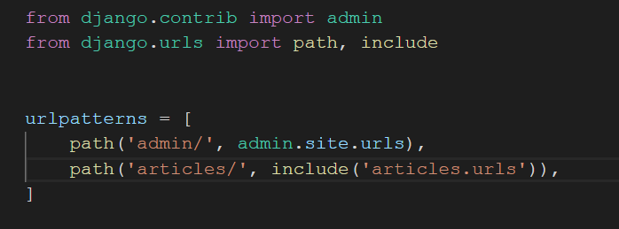
      - 프로젝트의 urls.py 상태. 연결을 articles 앱폴더의 urls 를 가져오도록 include를 사용
    - 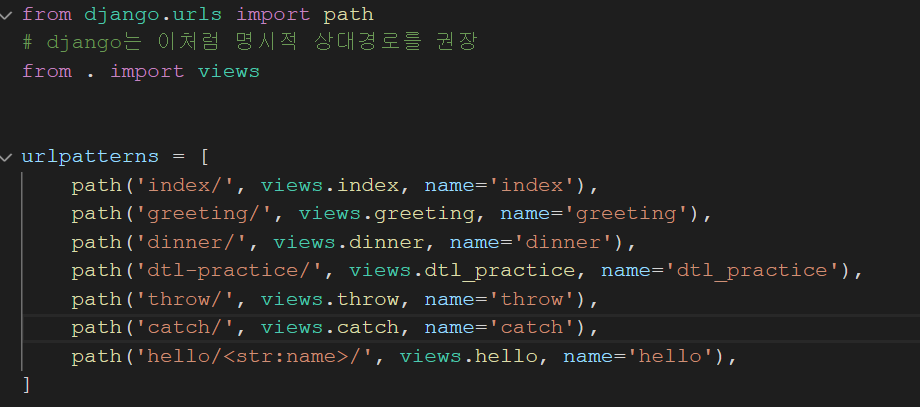
      - articles의 urls.py는 원래 프로젝트에 적었었던 articles와 연결되었던 페이지들을 그대로 가져와서 사용함.
      - 상단에 상대 경로 지정(. <<위의 폴더를 의미함)
    - 각 url에 이름을 지정하여 불러올 때 편하게 불러오도록 한다. 서버 경로가 바뀌어도 이름으로 고정되어 있으므로 urls에서만 수정하면 html에서는 수정할 필요가 없다.
      - 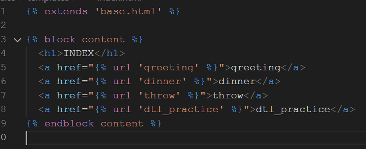
    
  - 실습문제 로또번호가 몇 등인지 계산하기
  
    - Api를 활용하기 (url을 가져와서 내용에 적용하기)
  
      import requetsts  선언을 통해 url에 포함된 정보를 변수에 저장해서 저장한 변수.json() 처리하기
  
    - 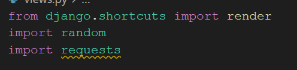
  
    - 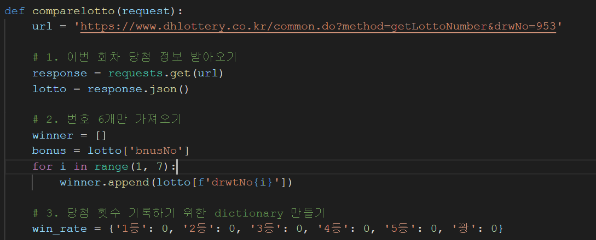
  
    - bnusNo  : url에 저장된 보너스 번호의 값 // drwtNo(1~6) : 당첨번호 6개 (오름차순)
  
    - 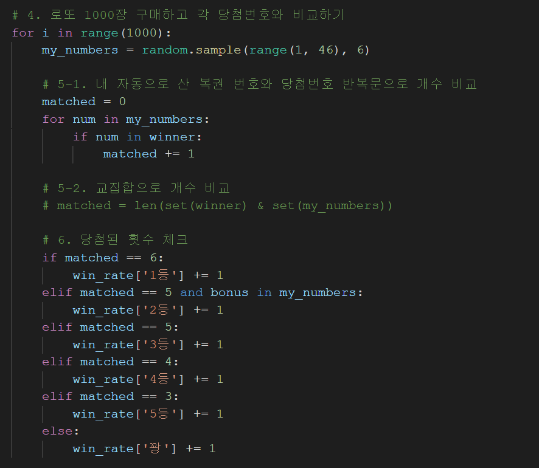
  
    - 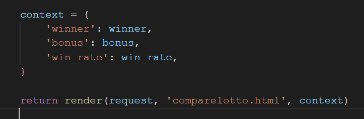
  
    - views에 위와 같이 작성을 완료한 후에 html 작성을 한다.
  
    - 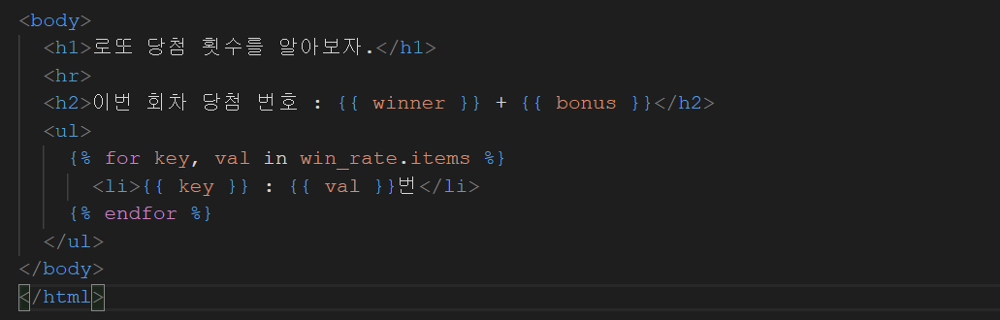
  
      key, val 에 win_rate 딕셔너리에 보관되어 있는 key 와 value의 값들을 받아서 리스트로 for문을 돌려 총6개의 결과를 나타낸다.


---

### 💁🏼‍♂️가장 기억에 남는 교육 내용

- `requests.get(url)` 으로 보내고 `response.json()`으로 받기

---

### 💫부족한 부분과 개선방향

- templates의 html 작성
  - 기존 html에서 작성하는 방식 말고 따로 django의 extend와 include등을 적극 활용해보도록 하자
- views 에서 사용하는 함수 작성
  - 하나씩 천천히 코드를 작성해보도록 하고 모르면 구글링을 통해서 관련 정보를 가져오자.
  - 쉽게 포기하지 말고 천천히 시간이 걸리더라도 해내보도록 하자. 그리고 모르는 것은 바로바로 물어보자!
  - 왜이렇게 물어보는 것을 어려워할까? 
    - 왜냐면 남들에게 피해끼치는게 싫으니까... 남들 시간도 소중하다고 생각하니까.
