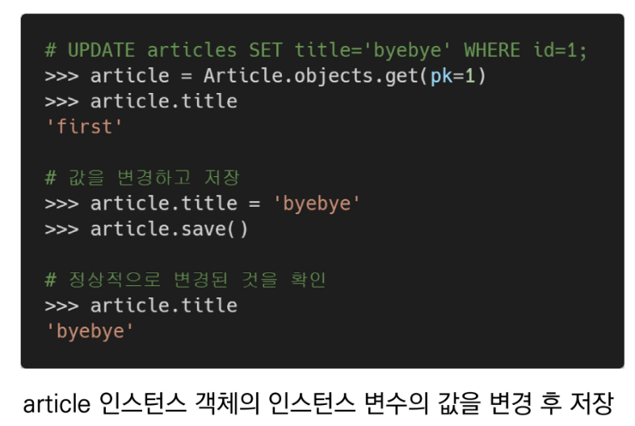

# 220308

### 👨🏼‍🏫과정 후기와 느낀점

- ### Django Model

  - 
    - 데이터에 대한 정보를 가지고 있다. 어떠한 행(레코드)과 열(필드)이 있고 어떠한 데이터 타입을 가지고 있는지를 이야기 함
    - 모델 하나당 데이터베이스 하나를 가지고 있다.

  - 
  - 
  - 
    - `테이블 = 관계` 라고도 부른다.

  - 
    - `열 = 컬럼 = 필드 = 속성` : 타입이 지정이 된다.

  - 
    - `행 = 로우 = 레코드 = 튜플` : 데이터가 지정이 된다.

  - 
    - 만약 나이를 기본키로 설정하게 된다면 나이가 같은 사람이 발생하면 오류가 나므로 주의해야 한다.

  - 
    - 결론 : 테이블의 모임 = 데이터베이스

  - 
    - 모델과 DB는 같은 존재가 아니라는 것 명확하게 알고 있어라!!
    - 모델은 DB를 관리하고 조작을 진행하는 도구라고 이해하면 된다.

- ### ORM

  - 
    - `RDBMS : 관계형 데이터 베이스`
    - 호환되지 않는 유형의 시스템 간 서로 중간에서 변환을 해줄 수 있는 프로그램이 필요한데 그것이 바로 ORM이라 한다.
    - 
    - SQL 문으로 작성한 것을 Python으로 보여주기 위해 ORM 도구가 변환시켜준다. 반대로도 진행

  - 
  - ORM의 사용이유는?
    - 

  - 
    - 최종적으로 만들어지는 table 은 총 3개 (PK(자동생성), title, content) 이다.
    - CRUD : CREATE 생성/READ 조회/UPDATE 수정,변경/DELETE 삭제
    - title과 content는 모델의 필드를 나타낸다 > 열을 나타낸다.
    - 매핑은 연결을 의미한다. 각각의 데이터 베이스에 열에 연결이 된다.
    - 스키마를 정의하고 있다는 것이다.
    - CharField(max_length=None, **options) : none글자 수 제한의 문자열 특성을 가진 필드를 만든다.
      - 

    - TextField( ) : 문자열 특성을 가진 필드를 만든다.
      - 

- ### Migrations

  - 
    - python managy.py `makemigrations` 와 `migrate`는 필수적으로 활용되는 명령어이므로 외워두기
    - DB를 만들기 위한 일종의 설계도라고 생각하면 된다.

  - 
    - 변경사항 ==(makemigrations)==> 설계도 ==(migrate)==> DB
    - models.py 에 변경(수정,삭제,추가)이 생겼다! => 바로 makemigrations 하기

  - 
    - 상황에 따라서 사용 (무언가 확인을 하기 위해서 사용)
    - sqlmigrate = ORM 이 python 에서 보낸 정보를 어떻게 SQL문으로 번역할 것인지 확인하는 명령어
      - `python manage.py sqlmigrate 앱이름 테이블번호`

    - showmigrations = 마이그레이션 되었는지 안되었는지 확인을 위해 (디버깅을 위해) 사용하는 명령어
      - `python manage.py showmigrations`
      - `[X]`라고 되어있는 것은 체크가 되어있다는 표시이다.

  - 정리
    - 
      - 순서 뒤바뀌지 말 것
      - 동기화는 연결이 아니다. 

  - 이미 데이터가 존재하는 가운데 열을 추가하게 된다면 어떻게 할 것인지 makemigrations에서 옵션을 묻는다.
    - 1)Provide a one-off default now (will be set on all existing rows)
     2) 2)Quit, and let me add a default in models.py
     2) 1번을 누르면 또다른 문장이 뜨고 그 안에서 값을 결정해주면 된다. (하단 그림 참조)
     2) 

  - 업데이트 후 내용을 확인하고 설계도를 SQL로 보내기 위해 migrate를 해준다. 그 다음 db.sqlite3의 새로고침 버튼을 눌러 업데이트 된 테이블을 확인한다.
  - 
    - 시험으로 자주 출제됨
    - auto_now_add : 최초 게시글 생성 시간을 자동으로 입력하며, 수정해도 시간이 갱신되면 안된다.
    - auto_now : 새로운 변경사항이 생길 때 마다 마지막 수정 시간이 입력되어야 한다.

  - 
    - 실제로 정의된 것은 DataField에 정의되어 있다.

### 

- ### DB API

  - 

- DB를 조작하기 위한 도구	
- 
  - 이와 같은 구조로 이루어져있다. (위의 예시는 조회하는 명령어)
  - 우리가 DB에서 보낸 SQL문을 ORM이 변환해서 받은 데이터 목록이 QuerySet이다.
  - 
- 
  - 
  - Django Extension 설치 후 shell_plus를 불러와 명령어를 입력한다. 기존 shell도 쓸수는 있지만 원활하게 조작하기 위해 `shell_plus`를 사용한다.

- ### CRUD

  - 

  - ##### CREATE

    - 인스턴스 변수에 값을 할당하는 방식으로 입력한다.
    - 
    - save()를 통해서 할당한 내용들을 데이터베이스에 저장하도록 한다.
    - 이후 Read를 하면 다음과 같이 보여진다.
    - 
    - 
    - 작성했던 내용들을 확인해보기 위해서 (Value를 확인) key값으로 접근하듯이 쓰면 된다.
    - id 대신 pk로 접근하는 것을 권장하고 있다. (하지만 헷갈림...)
    - 
    - 이처럼 한 문장으로 생성이 가능하다.
    - 
    - 두개의 객체가 생성되었다는 것을 확인할 수 있다.
    - 
    - create 를 사용하면 자동으로 save() 과정까지 처리되며 바로 리턴값이 나타난다.
    - 인스턴스 없이 글을 작성하는 방식이다. 인스턴스로 값을 소환하면 3번째 등록한 글이 아닌 2번째 등록한 내용이 보여진다.
    - 
      - save() 없이 내용만 적어봤자 DB에는 적용이 되지 않는다는 것 꼭!!! 잊지 말자
    - 
      - str 메서드를 적용하고 설계도가 변경되었다 생각하여 다시 makemigration을 해야한다고 생각할 수 있지만, 스키마가 변경된 것이 아니므로 변경 사항이 없다고 뜬다.

  - ##### READ (DB에서 가장 중요한 부분이다.)

    - 

    - 조회 시 다음 2가지의 경우로 내용을 반환한다.

      - 1.새로운 쿼리셋을 리턴하는 경우 (공식문서 참조)

      - 

        

        2.퀴리셋을 리턴을 하지 않는 경우 (공식문서 참조)

        

    - all() : 모든 쿼리셋을 리턴한다.

    - get() : 원하는 특정 쿼리셋을 골라 리턴할 수 있다. 

      - 
      - 고유성(유니크)을 보장하는 조회에서 사용해야 한다. pk값!!
      - 내가 1번 객체를 조회하고 싶다면? `article = Article.objects.get(pk=1)`를 작성하여 article 변수에 1번 값을 저장하여 수정할 수 있도록 한다.

    - filter() : get()이랑 달리 0개, 1개, 2개부터 쭉 다른 값들에 대한 조건을 검색한다. pk 값이 아닌 다른 매개변수의 값과 일치하는 것을 찾는다. 

      - 내용이 django! 라고 써져있는 것들을 찾아주세요! >> filter(content='django!') 

      - 

        - 없는 내용 조회 시 오류가 아닌 빈 값을 보여주고, 내용을 찾으면 어디에 있는지 값이 반환된다.
        - pk 값으로도 찾을 수 있다.

      - 

        __gt 와 같이 Field lookup 문을 통해서 특정 조건의 값을 조회할 수 있다.

        

      - 

        - 여기서 쓰인 __contains(특정 문자가 포함된 조건) 는 'an' 이 포함된 내용을 담은 content를 찾는다는 것

  - ##### UPDATE

    - 반드시 선 조회가 필요하다. (무엇을 수정하고 삭제할 것인지 결정해야 하므로)
    - 이후 인스턴스(변수) 에 값을 등록한 후 변경을 한 뒤 save()를 하여 DB에 변경한 값을 적용한다.
    - 

  - ##### DELETE

    - 
      - delete 또한 변수에 값을 지정해준 (조회) 후 값을 삭제하면 된다. save() 가 자동으로 된다.
      - 만약 앞 번호의 pk를 삭제 후 새로운 내용을 등록하면 pk가 앞의 삭제된 번호를 받는 것이 아닌 마지막 pk의 다음 번호가 붙는다. 재활용이 안됨 (재활용 가능은 하지만 효율성이 떨어짐)
      - 

---

### 💁🏼‍♂️가장 기억에 남는 교육 내용

- 시험에 나오는 것들.. 낚시 조심해야 할 문제..!

---

### 💫부족한 부분과 개선방향

- 
