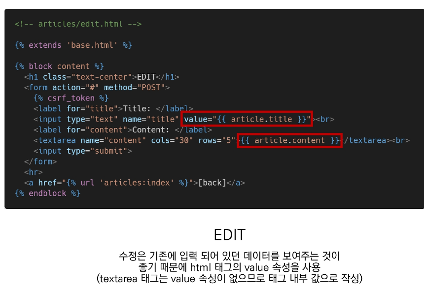
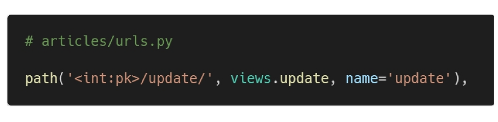

# 220310

### 👨🏼‍🏫과정 후기와 느낀점

- ### django models

- 
  - `method="POST"` 를 통해서 생성/변경/삭제가 가능하다. DB에 영향을 준다는 것을 잊지 말자.
  - DB에 대한 조작을 요청하는 것이므로 좀 더 강한 보안이 필요하다.

- 
  - 평소에 보던 페이지인 줄 알았지만, 알고보니 해킹범이 만든 가짜 페이지였던 것이다. 그 곳에서 로그인을 하면 정보가 털리거나 입력 데이터를 원 서버의 공격용도로 사용하기도 한다.

- 
  - 사용자로부터 데이터를 받을 때 토큰을 심어 본인이 만든 사이트에서 데이터가 온다는 것을 검증(확인)하고 원하는 정보를 사용자에게 보여주도록 한다.

- 
  - csrf_token 태그를 통해서 입력받은 정보에 난수를 더한다. 새로고침할때마다 난수 값이 변경된다.
  - `method="POST"`로 설정해두고 `` 이 없다면 아래와 같이 오류가 뜬다.
  - 
  - 
    - 입력한 데이터가 원하는 url에 보여지지 않고 유효성 검사 오류가 나서 그 페이지 내부의 Payload 에서만 Form Data를 볼 수 있다.
    - 검사 탭 > Network > payload 에 입력했던 내용이 보관되어 있다.
  - views.py 탭에서 이전에 `GET.get` 으로 되어있는 부분을 `POST.get` 으로 변경해준다.
    - 
    - `GET`은 특정 리소스를 가져오도록 요청할 때 사용하고, 반드시 데이터를 가져올 때만 사용한다. DB에 영향을 주지 않는다. (CRUD 중에서 `R` 의 역할)

- 
  - settings.py를 보면 MIDDLEWARE 부분이 있는데, 그 안에 적혀있는 코드들의 첫 줄부터 차근차근 유효성 검사가 이루어져서 

    마지막 줄에 도달했을 때까지 이상이 없다면 보내고자 하는 URL로 POST 메서드로 입력한 데이터가 전송된다.

  - 

  - ##### POST 요청을 할 수 있는 것은 무조건 form 태그밖에 없다.

  - HTTP method(verbs)

    - GET/articles/ => 게시글 목록을 요청
    - POST/articles/ => 게시글 생성을 요청

- #### 게시글을 작성하고 글 입력이 성공적으로 되었다는 페이지가 아닌 바로 게시판 목록으로 가려면 어떻게 해야할까?

  - 
  - 
    - 게시글을 작성한 후 바로 게시판 페이지로 이동하게 하는 것이 아니라 우선 게시글을 보내는 함수(create)를 선언하고, 그 함수가 있는 html를 만들어 글이 제대로 작성되는지부터 확인을 한다.
    - 그 다음 정보들을 가공하고 redirect 모듈을 활용하여 create 함수의 결과를 게시판 목록(index)으로 redirect 해준다.

- #### 게시판 목록에서 원하는 게시물을 클릭했을 때 자세하게 볼 수 있는 방법은?

  - 

    - #### Variable Routing 

      - 특정 주소 뒤에 `/문자` 혹은 `/숫자` 가 붙는 경우가 있는데 이러한 것들을 Variable Routing이라고 한다.
      - `index/<str:name>/` 이러한 식으로 추가하여 index/other 에서 other을 name이라는 변수로 지정하겠다는 의미이다.
      - `index/<int:pk>/` 으로 하면 뒤에 숫자를 받는다. index/14

  - 

    - modles.py 에 정의한 Article 클래스를 통해 입력된 데이터 정보들을 가져와 그 중 pk필드 정보를 detail/14 에서의 14에 맞는 pk를 가져오겠다는 것이다.

  - 

    - 디테일 페이지에 대한 예시 코드. 보면 몇번째(pk) 글인지, 제목, 내용, 작성, 수정시각을 보여준다.
    - index (기본) 페이지에서는 url 태그를 통해 detail 주소 후 `articles/detail/pk(숫자)` 에 맞게 이동하겠다는 것을 보여주고 있다.
    - 만약 내가 글을 작성하고 게시판 목록이 아닌 바로 작성한 게시글을 보고 싶다면?
    - 
    - create 함수에서 return redirect인자 주소를 변경하면 된다. 인자이므로 함수의 콤마가 들어간다. (url은 html의 특성이므로 함수와 달리 스페이스바로 구분함)

  - NoReverseMatch 가 뜨면 해당 html 페이지에서 url 태그를 확인해본다.

  - #### DELETE 는 어떻게 할까?

    - 삭제할 id(pk)/delete/ 주소를 지정해주어 함수를 호출한다.
    - delete 함수는 요청과 pk번호를 받아서 삭제하도록 한다.
      - 
    - 그런데 삭제할 때 아무런 검사 없이 바로 다 삭제가 이루어지면 안되고, 삭제할 특정 게시물만 지우도록 해야한다.
      - form 태그를 사용해 POST 메서드를 사용한다!!
      - 
    - 이후 기존에 작성해두었던 모든 글을 다 삭제하는 함수에서 조건을 붙여준다.
      - 
      - POST 메서드로 이루어진 삭제 버튼을 눌렀을 때 삭제가 이루어지고 게시판의 목록으로 돌아가도록 한다.
      - POST 메서드로 검증되지 않은 경우에는 다시 상세 페이지의 해당 글을 보여준다 (새로고침 작용)

  - #### 내 글을 수정하고 싶을 땐?

    - `<int:pk>/edit/` 주소를 가지도록 하여 해당 pk번호의 게시글을 수정하도록 한다.
    - 
      - 주소에 입력된 pk 값에 맞는 데이터를 변수에 저장하여 이를 context에 넣어 활용한다.
      - 수정 페이지는 아래와 같이 대략적으로 구성한다.
      - 
      - input 태그에 value를 넣어주는 이유는 value 값이 없으면 그냥 공백 텍스트 입력창이 떠서 그 안에 내가 작성했던 제목과 내용이 떠있어야 수정이 이루어지기 때문에 `value=" article.title "` 의 값을 지정해주는 것이다.
      - 그 아래 `textarea` 는 value를 속성으로 가지지 않으므로 여닫는 태그 사이에 {{ article.content }} 로 입력했던 내용을 띄우도록 한다.
      - Edit에서 수정한 글은 저장이 되면 기존의 글이 U (업데이트) 되는 것이기 때문에 아래와 같이 urls, views, html을 구성해주면 된다.
      - 
      - 
        - pk를 통해서 Article 클래스에 적용하기 위해 변수로 지정해주고, POST 메서드로 받아온 정보들을 저장해주고 save()로 데이터베이스에 반영되도록 한다.
        - 그리고 redirect를 통해 게시글의 디테일 페이지로 이동한다.
      - 

  

  - admin : automatic admin interface
    - 사용자가 아닌 서버의 관리자가 활용하기 위한 페이지
    - Model class를 admin.py에 등록하고 관리
    - django.contrib.auth 모듈에서 제공됨
    - record 생성 여부 확인에 매우 유용하며, 직접 record를 삽입할 수도 있음
    - 
      - `명령어를 통해서 관리자 아이디/비밀번호` 를 만들 수 있다.
      - 
      - 생성이 완료되면 DB에 저장되어 있다. `auth_user` 테이블
      - 
      - 
      - 보고자하는 테이블의 필드를 입력하여 admin 페이지에서 볼 수 있다.
      - 이 페이지에서 삭제, 수정도 가능하다.

---

### 💁🏼‍♂️가장 기억에 남는 교육 내용

- 싸버지의 망언...
  - 파이썬은 쓰레기 취급받는건가요..? 흑흑 말넘심

---

### 💫부족한 부분과 개선방향

- 부트스트랩 클래스
  - 부트스트랩 공식문서 꼭 참조해서 활용하도록 하자. 정답은 그 안에 있다.
- 태그 간 구조 태그 안에 태그?
  - form 태그 안에 a 태그 이용해서 글씨로 된 삭제버튼 구현하고자 했는데 구현하는데 어떻게 하는지 몰라서 그냥 a 태그로 수정하고 views.py 에 정의한 delete 함수를 누르면 작동하도록 변경함
