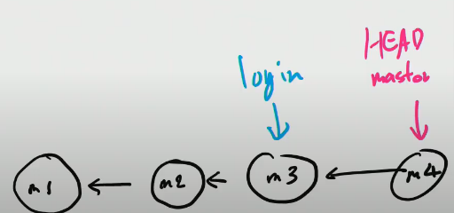
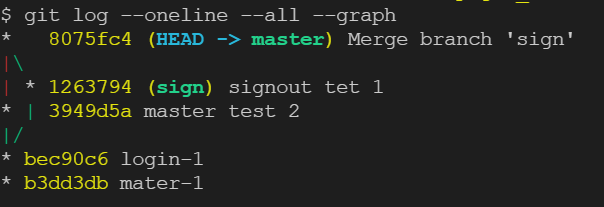
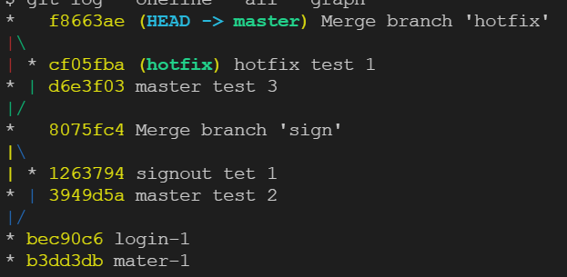

# 220311

### 👨🏼‍🏫과정 후기와 느낀점

- #### Git Branch

  - 깃이 관리하고 있는 트리 내부에 있어야 독립적인 공간으로 사용할 수 있다. 
  - staging area 에 한번도 올라가지 않은 파일은 브랜치 이동을 하더라도 모든 브랜치에서 보이게 된다.

- 관련 명령어 (조회, 생성, 삭제, 이동)	

  - ###### git branch

    - 브랜치 목록 확인

  - ###### git branch 브랜치 명

    - 새로운 브랜치 생성, 깃 커밋한 시점에 깃 브랜치 생성을 하면 그 커밋 위치에 브랜치에 위치한다.
    - 

  - ###### git branch -d(소문자) 브랜치 명

    - 특정 브랜치 삭제 (병합된 브랜치만 삭제)

  - ###### git branch -D(대문자) 브랜치 명

    - 강제 삭제

  - ###### git switch 브랜치 명

    - 다른 브랜치로 이동

  - ###### git switch -c 브랜치 명

    - 브랜치를 새로 생성하는 동시에 이동하는 과정

  - ###### git log --oneline --all

    - 현재 존재하는 브랜치와 마스터의 위치를 다 보여준다.

  - ###### git log --oneline -- all --graph

    - 생성된 깃들의 구조를 막대기(그래프) 형식으로 보여준다.

  - ##### merge(병합) = 병합 후 무조건 삭제

  - ###### git merge 병합할 브랜치 명

    - merge를 하기 전에 일단 다른 브랜치를 합치려고 하는 메인 브랜치로 switch 해야 한다. 

    - A랑 B를 합치려고 할 때, A를 메인으로 두고 싶으면 A브랜치로 이동 후 A 브랜치에서 merge 명령어를 실행해야 한다.

    - merge 가 된 이후 병합된 브랜치는 삭제해주어야 한다!!

      `git branch -d 병합한 브랜치 명`

  - ###### fast-forward

    - A에서 B 브랜치로 커밋을 할 때 B 브랜치가 최신 커밋을 가르키고 있을 때, A 또한 병합 후 B브랜치와 같은 커밋을 가르킨다.
    - 단순히 HEAD 가 앞으로 나갈 뿐이다.

  - ###### 3-way merge (merge commit)

    - 공통된 조상을 하나 만들어서 병합한다.
    - 

  - ###### merge conflict

    - merge하는 두 브랜치에서 같은 파일의 같은 부분을 동시에 수정하고 merge하면 git은 해당 부분을 자동으로 merge 해주지 못한다.
    - 반면 동일 파일이더라도 서로 다른 부분을 수정했다면 충돌없이 자동으로 merge commit이 된다.
    - 충돌이 일어난 이후 수정을 한 뒤 add 후 commit을 할 때는 바로 `git commit` 만 해주고 (자동으로 commit 명을 입력해준다.) vim 이 실행되도록 한다.
    - 이후 vim에서 commit 을 승인하기 위해 `:wq` 를 입력한다.
    - 

- 관통 PJT
  - CRUD 활용하여 영화 게시판 만들기

---

### 💁🏼‍♂️가장 기억에 남는 교육 내용

- 🦖🦖🦖🦖🦖🦖🦖🦖🦖🦖🦖🦖🦖🦖🦖🦖

---

### 💫부족한 부분과 개선방향

- git 에 대해서 기본적인 사항 말고도 브랜치 이해 다시 해보기
  - 깃..브랜치 예전에 했다가 실패했던 경험을 이제는 성공으로 바꿔보자
- 관통 PJT - 개념집, 코드 없이 풀어보기
  - 없으면 잘 못하는데 없어도 할 수 있게 반복학습 계속 해보자!!
