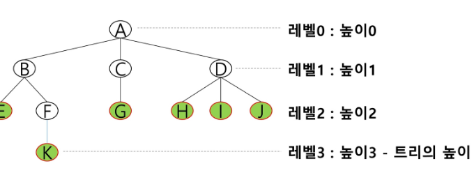
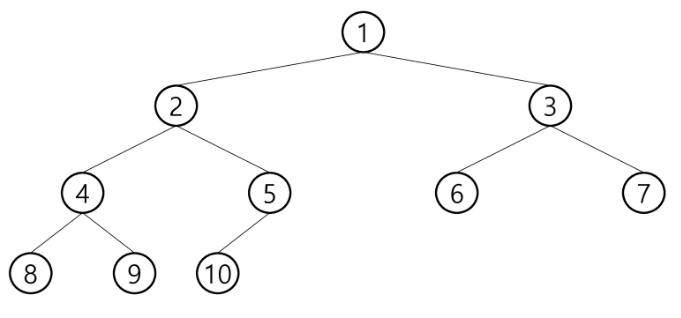

# 220316

### 👨🏼‍🏫과정 후기와 느낀점

- 트리

  - 비선형 구조
  - 원소들 간 1:n 관계를 가지는 자료 구조
  - 원소들 간에 계층 관계를 가지는 계층형 자료 구조

- 한 개 이상의 노드로 이루어진 유한 집합이며 다음 조건을 만족한다

  - 노드 중 최상위 노드를 루트(root)라고 한다.
  - 나머지 노드들은 n(>=0)개의 분리 집합 T1, T2,...,Tn 을 분리될 수 있다.
  - T1~Tn은 각각 하나의 트리가 되며(재귀적 정의) 루트의 부 트리(subtree)라고 한다.
  - 
    - E 하나만으로도 트리라고 볼 수 있다.

- 용어 정리

  - 노드(node) - 트리의 원소
    - 트리 T의 노드 - A,B,C,D,E,F,G,H,I,J,K

  - 간선(edge) - 노드를 연결하는 선, 부모 노드와 자식 노드를 연결
  - 루트 노드(root node) - 트리의 시작 노드
    - 트리 T의 루트 노드는 A
    - 

  - 형제 노드(sibling node) - 같은 부모 노드의 자식 노드들
    - B, C, D는 형제 노드

  - 조상 노드 - 간선을 따라 루트 노드까지 이르는 경로에 있는 모든 노드들
    - K의 조상 노드 : F, B, A

  - 서브 트리(subtree) - 부모 노드와 연결된 간선을 끊었을 때 생성되는 트리
  - 자손 노드 - 서브 트리에 있는 하위 레벨의 노드들
    - B의 자손 노드 - E, F, K

  - 차수(degree)
    - 노드의 차수 : 노드에 연결된 자식 노드의 수
      - B의 차수 = 2, C의 차수 = 1

    - 트리의 차수 : 트리에 있는 노드의 차수 중에서 가장 큰 값
      - 트리 T의 차수 = 3

    - 단말 노드(리프 노드) : 차수가 0인 노드, 자식 노드가 없는 노드

  - 높이
    - 노드의 높이 : 루트에서 노드에 이르는 간선의 수, 노드의 레벨
      - B의 높이 = 1, F의 높이 = 2

    - 트리의 높이 : 트리에 있는 노드의 높이 중에서 가장 큰 값, 최대 레벨
      - 트리 T의 높이 = 3


  

- 이진 트리

  - 모든 노드들이 2개의 서브트리를 갖는 특별한 형태의 트리
  - 각 노드가 자식 노드를 최대한 2개까지만 가질 수 있는 트리
    - 왼쪽 자식 노드 + 오른쪽 자식 노드
    - 

  - 특성
    - 레벨 i에서의 노드의 최대 개수는 2^i개
    - 높이가 h인 이진 트리가 가질 수 있는 노드의 최소 개수는 (h+1)개가 되며 최대 개수는 (2^h+1)-1 개가 된다.
    - 

- 이진트리 종류

  - 포화 이진 트리
    - 모든 레벨에 노드가 포화상태로 차 있는 이진 트리
    - 높이가 h일 때, 최대의 노드 개수인 (2^h+1)-1 의 노드를 가진 이진 트리
      - 높이가 3일 때 (2^3+1)-1 = 16-1 = 15개의 노드

    - 루트를 1번으로 지정하여 맨 마지막 (2^h+1) -1까지 정해진 위치에 대한 노드 번호를 가짐


  

  - 완전 이진 트리
    - 높이가 h이고 노드 수가 n개일 때(2^h <= n < (2^h+1)-1), 포화 이진 트리의 노드 번호 1번부터 n번까지 빈 자리가 없는 이진 트리
      - 노드가 10개인 완전 이진트리는 어떻게 생겼나?
    - 
      - 포화 이진 트리의 노드 번호 붙이는 방식과 동일하게 번호를 부여한다.
  - 편향 이진 트리
    - 높이 h에 대한 최소 개수의 노드를 가지면서 한쪽 방향의 자식 노드만을 가진 이진 트리
      - 왼쪽 / 오른쪽 편향 이진 트리
      - 

- 순회(traversal)

  - 트리의 각 노드를 중복되지 않게 전부 방문하는 것을 말하는데 트리는 비 선형 구조이기 때문에 선형 구조에서와 같이 선후 연결 관계를 알 수 없다. 그러므로 특별한 방법이 필요하다.

  - 트리의 노드들을 체계적으로 방문하는 것

  - 3가지의 기본적인 순회 방법

    - 전위 순회 (VLR) : 부모노드 방문 후, 자식 노드를 좌, 우 순서로 방문한다.

    

    - 중위 순회 (LVR) : 왼쪽 자식노드, 부모노드, 오른쪽 자식노드 순으로 방문한다.

    

    - 후위 순회 (LRV) : 자식노드를 좌우 순서로 방문한 후 부모노드를 방문한다.

    

- 순회 자세히 알기

  - 전위 순회(preoder traversal)

    - 수행방법
      - 현재 노드 n을 방문하여 처리한다 : V
      - 현재 노드 n의 왼쪽 서브트리로 이동한다 : L
      - 현재 노드 n의 오른쪽 서브트리로 이동한다 : R

    - 알고리즘

    ```python
    def pre_order(v):
        if v: # 0번 정점이 없기 때문에 (0번은 자식이 없는 경우를 표시한다, 만약 0번 노드가 존재하면 -1 이런식으로 자식없음을 표시한다)
            print(v)  # visited(v)에 해당하는 것
            pre_order(ch1[v])  # 왼쪽 자식으로 이동
            pre_order(ch2[v])  # 오른쪽 자식 이동
    ```

    

  - 중위 순회(inorder traversal)

    - 수행 방법
      - 현재 노드 n의 왼쪽 서브트리로 이동한다 : L
      - 현재 노드 n을 방문하여 처리한다 : V
      - 현재 노드 n의 오른쪽 서브트리로 이동한다 : R
    - 알고리즘

    ```python
    def in_order(v):
        if v:
            in_order(ch1[v])  # 왼쪽부터 시작
            print(v)  # 방문한곳 표시
            in_order(ch2[v])  # 오른쪽부터 시작
    ```

    

  - 후위 순회(postorder traversal)

    - 수행 방법
      - 현재 노드 n의 왼쪽 서브트리로 이동한다 : L
      - 현재 노드의 n의 오른쪽 서브트리로 이동한다 : R
      - 현재 노드 n을 방문하여 처리한다 : V
    - 알고리즘

    ```python
    def post_order(v):
        if v:
            post_order(ch1[v])  # 왼쪽 순회
            post_order(ch2[v])  # 오른쪽 순회
            print(v) # 방문표시
    ```

    

    - 트리의 루트가 가장 마지막에 처리된다.

- 이진트리의 표현

  - 배열을 이용한 이진 트리의 표현

    - 이진트리에 각 노드 번호를 다음과 같이 부여
    - 루트의 번호를 1로 한다.
    - 레벨 n에 있는 노드에 대하여 왼쪽부터 오른쪽으로 2^n 부터 (2^n+1)-1 까지 번호를 차례로 부여

    

    

  - 노드 번호의 성질

    - 노드 번호가 5인 경우

      - 노드의 부모 노드 번호는 ? 5 / 2 = 2

      - 노드의 왼쪽 자식 번호 ? 2 * 5 = 10

      - 노드의 오른쪽 자식 번호 ? 2 * 5 + 1 = 11

      - 레벨 n의 노드 번호 시작 번호는 ? 2^n

    

    

  

  - 이 부분에 대해서 다시 물어보기 (이해를 못함)

- 이진 트리의 저장

  - 부모 번호를 인덱스로 자식 번호를 저장함

    

    - 정점의 개수나 간선의 개수가 주어지면 트리의 상태를 알 수 있다.
    - 부모번호의 인덱스로 자식 번호를 저장하자. 인덱스 리스트를 두개 만들어서 기존 인덱스에 저장되어 있는 번호를 없애지 않고 그 아래의 리스트에 새로운 번호를 넣어버린다.

  - 

---

### 💁🏼‍♂️가장 기억에 남는 교육 내용

- 

---

### 💫부족한 부분과 개선방향

- 
