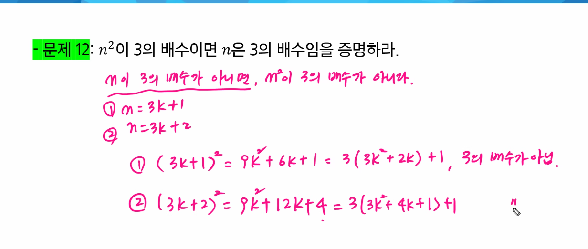
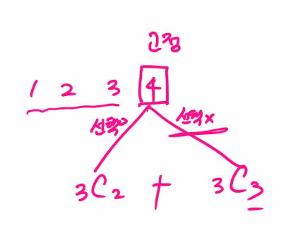
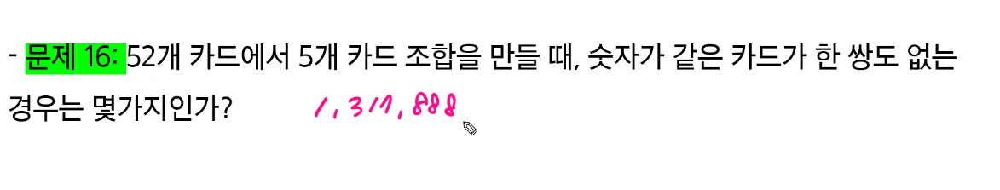
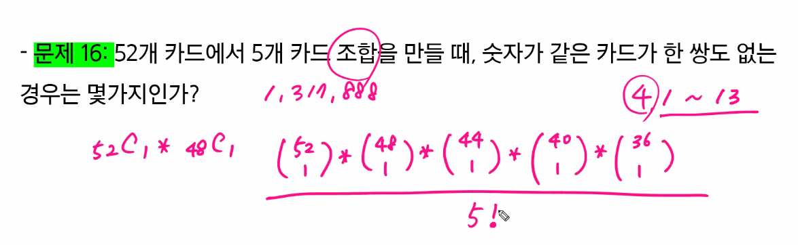
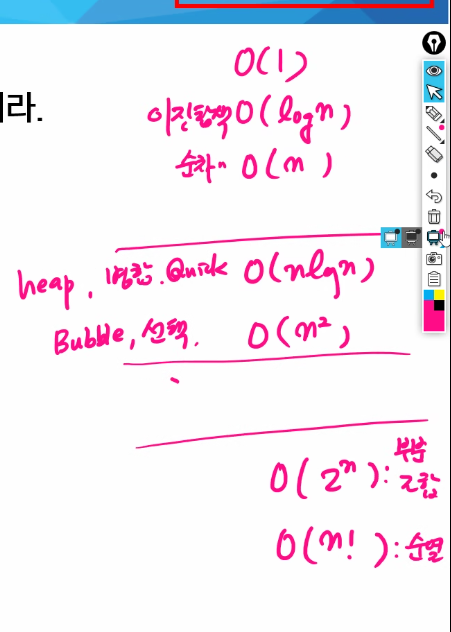
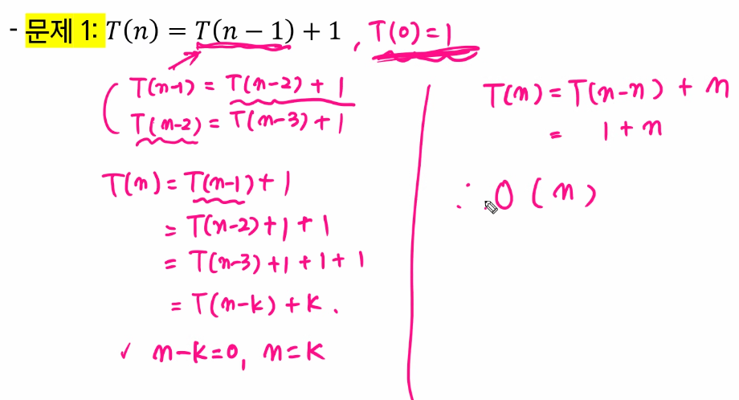
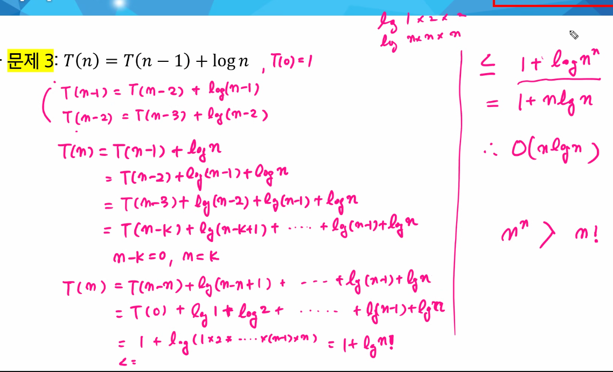
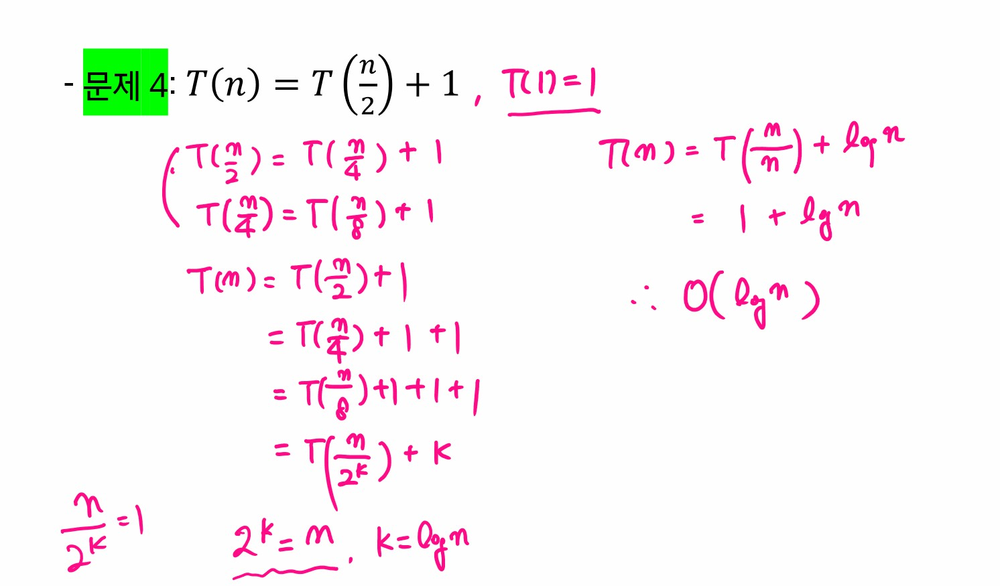

# 220321

### 👨🏼‍🏫과정 후기와 느낀점

- 과목평가
  - Django


#### CT (컴퓨터적 사고)

- 프로그래밍과 논리 수학
  - 이산수학
    - 이산적 : 논리, 집합.... 
    - 연속적 : 미분, 적분...

  - 집합, 명제, 논리, 확률, 함수, 행렬, 트리, 그래프...
    - 논리 => 모든 프로그래밍
    - 집합, 논리, 명제, 확률 => 기계학습, 인공지능
    - 행렬 => 영상처리, 그래픽스, 기계학습
    - 트리, 그래프 => 자료구조, 알고리즘
  - 논리와 증명
    - 사전학습에서 했던 카드와 맥주 문제

  - 조건 명제
    - 조건이 거짓이거나 결과가 참이면 참이다.
    -  앞의 조건이 거짓이면 뒤의 것이 거짓임을 증명할 방법이 없으므로 참이다
  - 자명한 증명
    - 어떠한 증명을 하는데 어떠한 것이 항상 참인 경우

  - 명제 간소화
    - 같은 애들끼리 묶끼 
    - 
    - P ^ 항진명제 = P 이다.

  - 모든 = 하나 이상의 반례찾기 / 어떤 = 하나라도 찾기


- 수와 표현
  - 하나의 수학 식에도 다양한 말로 표현할 수 있다.
  - x = logn 과 2^x = n 은 같은 말이다.
    - log n 이란?
    - 2의 몇 승이 n이 되느냐의 답
    - n을 표현하는 데 몇 비트가 필요한가의 답
    - 1로 시작해서 계속 두 배를 할 때 몇 번하면 n이 되느냐의 답
    - n을 2로 계속 나눌 때 몇 번 나누면 거의 1이 되느냐에 대한 답


- 집합과 조합론
  - 조합론은 경우의 수를 따지는 문제들을 보통 말한다.
  - 귀류법 : 현 명제가 참임을 증명하고 명제의 부정을 참이라 가정
    - 모순을 증명해서 원래의 명제가 참임을 보임


- 기초 수식
  - 풀이법을 익혀두어야 알고리즘의 시간 복잡도를 계산할 수 있고 알고리즘이 시간이 얼마나 걸릴지 예측할 수 있다.
  - 재귀함수의 연산량을 식으로 표현한 것이라 생각하면 된다.
  - 월말평가 문제 여기서 하나 나옴


- 재귀

  - 수학적 귀납법 증명 사용 가능

  ```python
  def fibo(n):
      if n == 1 or n == 2:
          return 1
     	return fibo(n-1) + fibo(n-2)
  ```

  T(N) 

  = T(N-1) + T(N-2) + 1

  = T(N-1) + T(N-1) + 1  # T(N-2) 가 T(N-1) 이 된 이유 ? N이 충분히 큰 수라서 N-1로 해줘도 상관 없다. 

  = 2T(N-1) + 1

  = 2^T(N-2) + 2 + 1

  = 2^KT(N-K) + 2^(K-1) + 2^(K-2) + ... + 1

  = K를 N-1로 보자

  = 2^(N-1)T(1) + 2^(N-2) + ... + 1

  = 2^(N-1)T(1) + 2^(N-1) + 1

  = 2^N - 1

  = T(N) = O(2^N-1) ====> O(2^N)


- 동적 프로그래밍

  - 하향식 (memoization 피보나치)

  ```python
  def fibo(n):
      if n < 2:
          return n
      if lst[n]:
          return lst[n]
      lst[n] = fibo(n-1) + fibo(n-2)  # 리스트에 저장을 해나가는 것
      return lst[n]
  
  n = 6
  lst = [0] * (n-1)
  print(fibo(n))
  ```

  

  - 상향식 (DP 피보나치)

  ```python
  # 순서를 정해서 사용한다
  def fibo(n):
      lst = [1, 1]
      if n < 2:
          return lst[n]
      while len(lst) < n:
          lst.append(lst[-1] + lst[-2])
      return lst[-1]  # 길이가 n보다 커지는 순간 마지막 값을 출력한다.
  ```

  

- 시간 복잡도 big O의 특징
  - 복잡도의 점근적 상한을 나타냄
  - 복잡도의 다항식 최고차항만 계수 없이 취하면 된다
    - 상수항 무시
      - O(2N), O(N/2) => O(N)
    - 영향력 없는 항은 무시
      - O(n^2+2n+1) => O(n^2)


- 점근적 표기법
  - 상수 계수와 중요하지 않은 항목을 제거한 것


- 보충

  - 논리곱 AND

    - ^ 연산자
    - 2^n < 승으로 이야기하는 것
    - 곱은 둘다 참이여야 참이다!

  - 논리합 OR

    - p, q 가 명제일 때, p, q 중 하나만 참일 때 참이 되는 명제
    -  비트 연산자 XOR 을 이야기함
    - 토글키

  - 조건명제

    - p->q (p이면 q이다.)
    - 만약 비가 오면, 우산을 가져간다.

  - 쌍방향도 알고

  - 역, 이, 대우

  - 수학적 귀납법을 활용해서 재귀식이나 점화식을 구한다.

  - 

  - ##### x = log n 과 2^x = n 은 같은 말

  - 조합과 관련된 것

  - 

  - 

  - 부분집합 O(2^n), 피보나치 O(2^n)



숫자카드 1~13까지 있음



https://craftjj.neocities.org/index.1.html  # 순열 조합 계산기 사이트










---

### 💁🏼‍♂️가장 기억에 남는 교육 내용

-  'P이면 Q이다'에서 전건 P가 거짓인 경우에 명제가 항상 참이라는 게 납득되지 않기 쉬운데 해당 명제는 P가 사실이 아닌 어떤 경우에도 반박되지 않는다는 걸 생각하면 생각보다 자연스러울 수도 있어여. .이번 시험에서 100점을 맞으면 대통령이 된다'라는 명제는 말도 안되어 보이지만 만일 내가 100점을 맞지 못했으면 저 명제가 거짓임을 보일 수 있는 방법은 없다는 걸 생각하면 자연스러울 수 있을거 같습니당
- 이게 이상해보이는 이유는 일상적인 조건문 사용이 지금 여기서 사용하는 실질 조건문 뿐만 아니라 가정적 사용인 경우도 많아서 그런데요 실질 조건문을 분석하는 논리적 체계는 또 따로 있습니당.
  - 6반 척척석사 희재님의 설명
-  10억 7 => 소수이다.


---

### 💫부족한 부분과 개선방향

- 와... 수학 너무 어렵다
  - 이 공식 증명하는 것을 알아야한다는데 모르겠다.
