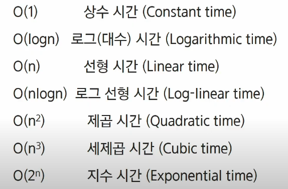
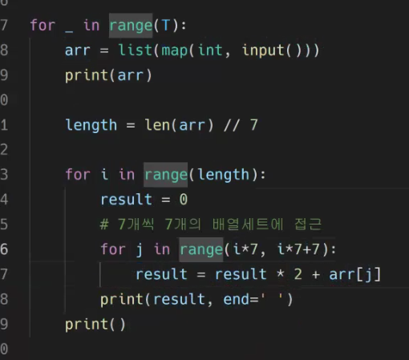

# 220323

### 👨🏼‍🏫과정 후기와 느낀점

- START (초심)

  - 복잡도 표시

    - f(n) = O(g(n))
    - g(n) 은 f(n)이 갖고 있는 가장 높은 차수만 가지고 와서 표현

  - 빅 오메가 표기

    - 복잡도의 점근적 하한을 의미
    - 빅오 표기와 같이 최고 차항을 기준으로 결정한다. 계수 없애고
    - ''최소한 이만한 시간은 걸린다'' 는 의미이다.

  - 세타 표기

  - 자주 사용하는 빅오 표기

    

    - 입력에 상관없이 늘 일정함 : 상수시간
    - 반의 반의 반의... : 로그 시간
    - 세제곱 시간까지 가면 잘못짜면 위험해지는 수준이 된다.
    - 입력이 작으면 어려운 문제일 가능성이 있다.

  - 버퍼가 차면

    - 콘솔 버퍼의 기본 사이즈가 1MB 정도의 사이클릭 버퍼이다. (순환 큐 같이 돌면서 채워오다가 이미 입력된 장소에 덮어버리는 것)

  - 비트 연산자

    - 비트연산 : 자기 자리에서만 연산을 하고 끝냄 (빌려주거나 받거나 다른 변환되는 일이 없다)
    - & : 비트단위로 AND 연산을 한다
      - 비트 검사 : &를 사용해서 그 자리에 어떠한 비트가 있는지 확인
      - 비트 클리어 : &를 이용, 특정 비트를 0으로 만든다.

    - |: 비트단위로 OR 연산을 한다. 
      - 비트 셋 : 특정 비트를 1로 변환

    - ^ : 비트 단위로 XOR 연산을 한다 (같으면 0, 다르면 1)
      - 같은지 검사하는 것, 전체 비트가 같은지를 확인하여 0 또는 1로 반환

    - ~ (인버트) : 단항 연산자로서 피연산자의 모든 비트를 반전시킨다.
      - 0 0 0 1 0 0 > 111011 이런식으로 전환

    - 쉬프트 연산
      - << : 피연산자의 비트 열을 왼쪽으로 이동시킨다.
        - num << 2 : 왼쪽으로 두 칸을 옮기기 num = 00001 > 00100

      - `>>`: 피연산자의 비트 열을 오른쪽으로 이동시킨다.
        - num >> 2 : 오른쪽으로 두 칸을 옮기기 

  - 엔디안

    - 빅 엔디안 : 보통 큰 단위가 앞에 나옴. 네트워크
    - 리틀 엔디안 : 작은 단위가 앞에 나옴. 대다수 테스크탑 컴퓨터

  - 진수

    - 1의 보수 : 부호와 절대값으로 표현된 값을 부호 비트를 제외한 나머지 비트들을 0은 1로, 1은 0로 변환한다.

- 웹엑스
  - 연습문제 1
  - 
    - 전체 연결된 arr 길이를 7개씩 나누어서 횟수를 정함 (len(arr)//7)
    - 그리고 for 문을 돌려서 리스트의 값들을 십진수로 전환하여 결과에 넣는다.
    - i*7, i*7+7 : 1~7자리, 8~14자리
  - 연습문제2
    - int를 활용하여 16을 10진수로 전환하기
    - 10진수로 전환한 다음 다시 2진수로 전환하기, 그 과정에서 0인경우와 2진수임을 나타내는 0b가 있는 경우 처리 방법
    - 2진수 전환 이후 0의 개수가 모자른 곳에 0을 앞에 더하는 코드 작성하기
    - 0을 넣어주고나서 만들어진 2진수들을 다 연결해준 뒤, 7개씩 잘라서 10진수로 만들기 
  - 연습문제 3
    - 위와 동일한 과정을 거친 후 암호비트패턴을 찾아서 출력하면 됨
    - 암호비트패턴의 규칙성을 발견해서 적용하면 된다.

- 유라 (오후)
  - 재귀
    - 종료조건을 설정 잘 하기
    - 배열을 벗어나는지 (인덱스) 조건 설정 잘하기
    - 초보자는 완전탐색을 이용해서 재귀를 사용해라.

---

### 💁🏼‍♂️가장 기억에 남는 교육 내용

- 

---

### 💫부족한 부분과 개선방향

- 이해력 부족
  - 특히 비트 연산... 진수 이런거 잘 모른다.
  - 알고리즘에서는 사용을 잘 안한다고는 하는데.. 그럼 DFS BFS를 집중하자 월말평가
  - 재귀 부분에서 문제에 대해서 설명하는 것에 대해서도 이해가 적으니.. 이 부분도 주의
